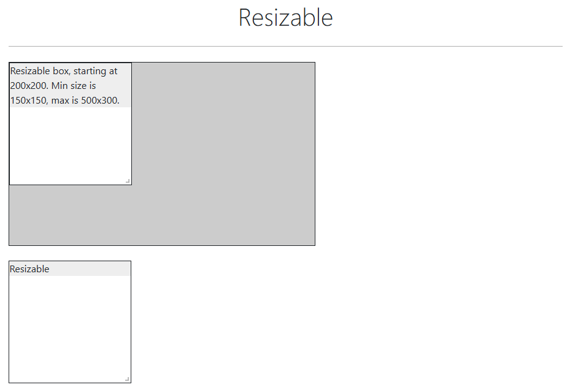
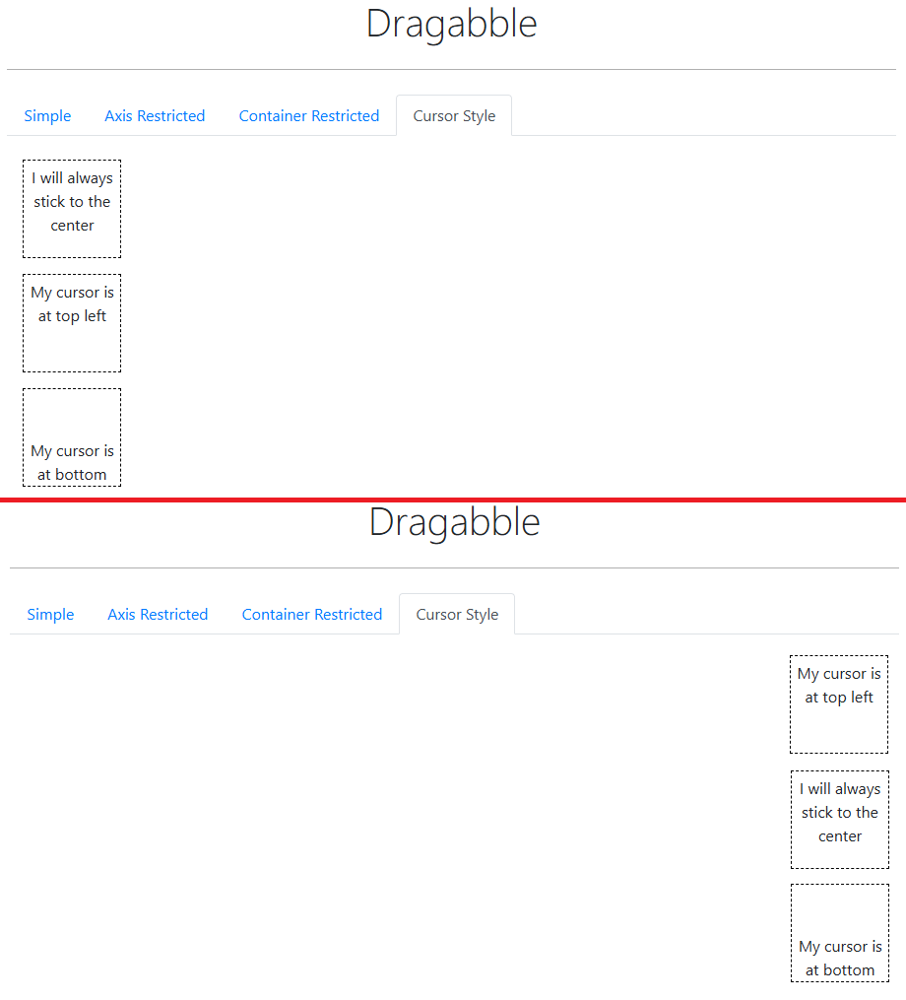

# ✅Selenium i testy — notatki

# 📑Spis treści

- [START – rozpoczęcie pisania testów](#start_writing_tests)
- [Konwencja nazewnictwa testów](#name_convention_tests)
- [WebDriver](#web_driver_description)
- [BasePage](#base_page_description)
- [BasePage — wyjaśnienie konstruktorów i "parent"](#base_page_parent)
- [TestBase](#test_base_description)
- [Fluent Object Pattern](#fluent_object_pattern)
- [Wzorzec Arrange-Act-Assert](#AAA)
- [@FindBy – "lokator" vs 'lokator'](#find_by_locator_quotation_marks_vs_apostrophes)
- [Xpath – znajdowanie po tekście](#xpath_find_by_text)
- [CSS — Sprawdzenie atrybutu elementu np. kolor](#css_color)
- [WebElement — Sprawdzanie, czy nie ma elementu na stronie](#assert_no_element)
- [Pobieranie plików](#pobieranie)
- [Logowanie/Sesja – sposoby na bycie zalogowanym pomiędzy testami](#login_session_methods)
- [Logowanie/Sesja — zapamiętanie zalogowania za pomocą cookies na różne sposoby](#login_session_cookies)
- [Slider — metody](#slider_methods)
- [Wait — pollingEvery()](#wait_polling_every)
- [Resize — zmiana wielkości pól tekstowych i innych, podobnych elementów](#resize_text_area)
- [Drag And Drop — Przesuwanie elementów do konkretnego miejsca na stronie](#drag_and_drop_to_set_location)
- [JUnit — ustawianie kolejności odpalania testów](#junit_test_order)
- [getAttribute() rozbite na getDomAttribute() oraz getDomProperty — różnice](#get_dom_attribute_property)
- [Tabele — pomijanie nagłówków](#tables_skip_headers)

---

# 📝Opis

## 📄START – rozpoczęcie pisania testów <a name="start_writing_tests"></a>

1. Jeżeli mamy kilka serwisów do pokrycia testami, to tworzymy na nie osobne katalogi w `main/java` oraz w `test/java`.  
   &emsp;📂src  
   &emsp;&emsp;📂main  
   &emsp;&emsp;&emsp;📂java  
   &emsp;&emsp;&emsp;&emsp;📁+ nazwa_serwisu  
   &emsp;&emsp;📂test  
   &emsp;&emsp;&emsp;📂java  
   &emsp;&emsp;&emsp;&emsp;📁+ nazwa_serwisu  
   Jeżeli później będziemy używać jakichś załączników to również w katalogu `java/resources` tworzymy katalogi z nazwami naszych serwisów.
2. W katalogu `java/resources` tworzymy plik o nazwie `config.properties`.  
   Wszelkie ustawienia projektu warto trzymać i odczytywać z osobnego pliku, aby nie musieć nic zmieniać w samym kodzie.  
   Zapisujemy tam takie rzeczy jak:
   - przeglądarka
   - czy jest tryb "headless"
   - URL
   - czas trwania domyślnego czekania na element
3. W głównym katalogu `java` (i katalogu serwisu) tworzymy katalog o nazwie `enums`
4. W katalogu `enums` tworzymy enum o nazwie `Browser.java`
5. Podajemy w nim nazwy przeglądarek
6. W głównym katalogu `java` (i katalogu serwisu) tworzymy katalog o nazwie `configuration`
7. W katalogu `configuration` tworzymy klasę (plik java) o nazwie `Config.java`
8. W klasie tej tworzymy:
   - mechanizm czytający i re-używający plik konfiguracyjny
   - metodę pobierającą przeglądarkę
   - metodę pobierającą url
   - metodę pobierającą czy jest tryb "headless"
   - metodę pobierającą domyślny czas czekania na element
9. W głównym katalogu `java` (w katalogu serwisu) tworzymy katalog o nazwie `pages`
10. W katalogu `pages` tworzymy katalog `base`
11. W tym katalogu `base` tworzymy klasę (plik java) o nazwie `BasePage.java`
12. Uzupełniamy naszą klasę `BasePage`:  
    (Dokładne dane będą w kodzie, tutaj tylko spis ogólny)
   - Zmieniamy na klasę abstrakcyjną
   - Definiujemy zmienne WebDriver, WebDriverWait, Actions
   - Definiujemy konstruktor
   - (opcjonalne) Definiujemy drugi konstruktor, który używa obiektu `DefaultElementLocatorFactory`
   - Definiujemy metodę konfigurującą WebDrivera
   - (opcjonalne) Możemy dodawać metody nadpisujące domyślne metody o dodatkowe logowanie wykonywanych akcji w konsoli
   - (opcjonalne) Możemy definiować metody / typy generyczne <T>
13. W głównym katalogu `java` (w katalogu serwisu) tworzymy katalog o nazwie `providers`
14. W tym katalogu `providers` tworzymy klasę (plik java) o nazwie `DriverProvider.java`
15. Tworzymy w nim `switch`, który będzie nam zmieniał przeglądarkę w zależności od ustawień
16. W tym katalogu `providers` tworzymy klasę (plik java) o nazwie `UrlProvider.java`
17. Umieszczamy w nim zmienną bazowego URL'a oraz zmienne innych URLi z jego wykorzystaniem
18. W katalogu z testami `test/java` (w katalogu serwisu) tworzymy katalog o nazwie `base`
19. W tym katalogu `base` tworzymy klasę (plik java) o nazwie `TestBase.java`
20. Ustawiamy w nim `@Before` inicjujący drivera i stronę główną oraz `@After` zamykający drivera
21. W katalogu z `pages` tworzymy katalog o nazwie `commons`. Będzie on zawierał obiekty page wspólne dla pozostałych obiektów page. Takie jak strona główna (HomePage) oraz menu strony (MenuPage) itp.
22. W tym katalogu `commos` tworzymy klasę (plik java) o nazwie `HomePage.java`
23. W `HomePage` rozszerzamy tę klasę o `...extends TestBase` i tworzymy konstruktor tej klasy nadpisujący drivera za pomocą `super` oraz dodajemy lokatory i metody
24. Dodajemy kolejny page, do którego będziemy przechodzić z naszej strony głównej. W tym przypadku będzie to `ElementsPage.java`
25. Dodajemy kolejny page, który pokryjemy pierwszymi testami o nazwie `TextBoxPage`
   - W jego metodach dodajemy na koniec `return this;` dzięki czemu będziemy mogli stosować Fluent Object Pattern
26. Tworzymy w `test/java` katalog na testy danej grupy stron `elements_tests`
27. Tworzymy klasę dla pierwszych testów `TextBoxTests`
28. Piszemy i odpalamy nasze pierwsze testy

---

## 📄Konwencja nazewnictwa testów <a name="name_convention_tests"></a>

### **📌 Konwencja nazewnictwa klas i klas testowych w Java**

Java ma ściśle określone konwencje nazewnictwa klas i klas testowych. Oto najlepsze praktyki:

### **1️⃣ Klasy produkcyjne**
🔹 **Styl:** PascalCase (każde słowo z dużej litery, bez podkreślników)  
🔹 **Nazwa powinna jasno wskazywać, co robi klasa**  
🔹 **Nie używamy skrótów, jeśli nie są powszechnie znane**

✅ **Poprawne nazwy klas:**
```java
public class UserService { }
public class DataProcessor { }
public class PaymentGateway { }
public class FileReader { }
```
❌ **Błędne nazwy klas:**
```java
public class userService { }  // ❌ Zaczynamy wielką literą
public class data_processor { }  // ❌ Nie używamy podkreślników
public class File_Reader { }  // ❌ Nie mieszamy stylów
public class SrvcUsr { }  // ❌ Nie używamy dziwnych skrótów
```

### **2️⃣ Klasy testowe**
#### 📍 **Konwencja nazewnictwa: `NazwaKlasyTest`**
🔹 **Dopasowujemy nazwę testu do klasy, którą testujemy**  
🔹 **Dodajemy sufiks `Test`**

✅ **Poprawne nazwy klas testowych:**
```java
public class UserServiceTest { }
public class DataProcessorTest { }
public class PaymentGatewayTest { }
public class FileReaderTest { }
```
❌ **Błędne nazwy klas testowych:**
```java
public class TestUserService { }  // ❌ Słowo "Test" na początku zamiast na końcu
public class UserServiceTests { }  // ❌ "Tests" zamiast "Test" (w Java preferujemy liczbę pojedynczą)
public class UserTestService { }  // ❌ Niepoprawna kolejność słów
```

### **3️⃣ Nazewnictwo testów jednostkowych**
🔹 **Metody testowe powinny jasno wskazywać, co testują**  
🔹 **Preferowane formaty:**
- `shouldCośTamWhenCośTam()`
- `givenCośTamWhenCośTamThenCośTam()`
- `testCośTam()` (ale mniej popularne w nowoczesnym kodzie)

✅ **Przykłady poprawnych metod testowych:**
```java
@Test
void shouldReturnUserWhenUserExists() { }

@Test
void givenValidInputWhenProcessingDataThenReturnExpectedResult() { }

@Test
void testAddItemToCart() { }  // (starszy styl, ale poprawny)
```

❌ **Błędne nazwy metod testowych:**
```java
@Test
void userTest() { }  // ❌ Nie mówi, co testujemy

@Test
void test() { }  // ❌ Zbyt ogólne

@Test
void shouldProcessData() { }  // ❌ Brakuje warunku, kiedy to się dzieje
```

### **4️⃣ Testy integracyjne**
#### 📍 **Konwencja nazewnictwa: `NazwaKlasyIT` lub `NazwaKlasyIntegrationTest`**
🔹 **Używamy sufiksu `IT` (skrót od "Integration Test") lub `IntegrationTest`**

✅ **Przykłady poprawnych nazw klas testów integracyjnych:**
```java
public class UserServiceIT { }
public class PaymentGatewayIT { }
public class DataProcessorIntegrationTest { }
```
❌ **Błędne nazwy:**
```java
public class IntegrationTestUserService { }  // ❌ "IntegrationTest" na początku zamiast na końcu
public class UserServiceIntegration { }  // ❌ Brak "Test" lub "IT" na końcu
```

### **🚀 Podsumowanie**
| **Rodzaj klasy**       | **Konwencja nazewnictwa**                                          | **Przykłady poprawnych nazw**                                                                     |
|------------------------|--------------------------------------------------------------------|---------------------------------------------------------------------------------------------------|
| **Klasa produkcyjna**  | PascalCase                                                         | `UserService`, `DataProcessor`                                                                    |
| **Klasa testowa**      | `NazwaKlasyTest`                                                   | `UserServiceTest`, `FileReaderTest`                                                               |
| **Testy integracyjne** | `NazwaKlasyIT` lub `NazwaKlasyIntegrationTest`                     | `UserServiceIT`, `PaymentGatewayIntegrationTest`                                                  |
| **Metody testowe**     | `shouldCośTamWhenCośTam()` lub `givenCośTamWhenCośTamThenCośTam()` | `shouldReturnUserWhenUserExists()`, `givenValidInputWhenProcessingDataThenReturnExpectedResult()` |

Trzymając się tych konwencji, kod będzie czytelny, spójny i łatwy do utrzymania! 🚀

---

## 📄WebDriver <a name="web_driver_description"></a>

### **🔹 WebDriver – co to jest?**

**WebDriver** to interfejs w Selenium, który umożliwia automatyczne sterowanie przeglądarką internetową. Pozwala na
wykonywanie testów UI, symulując interakcje użytkownika, takie jak **klikanie, wpisywanie tekstu, nawigowanie
czy pobieranie atrybutów elementów**.

WebDriver działa bezpośrednio na poziomie przeglądarki, co oznacza, że nie wymaga dodatkowego środowiska
(*np. Selenium Server*), jak to było w **Selenium 1 (RC)**.

### **🔹 Jak działa WebDriver?**

1️⃣ **Kod w Selenium** wysyła komendy do WebDrivera.  
2️⃣ **WebDriver komunikuje się z przeglądarką** poprzez jej natywne API.  
3️⃣ **Przeglądarka wykonuje operację**, np. klika w przycisk.  
4️⃣ **WebDriver zwraca wynik do testu**.

📌 Każda przeglądarka ma swój własny sterownik (np. `chromedriver.exe` dla Chrome, `geckodriver.exe` dla Firefox),
który WebDriver wykorzystuje do sterowania nią.

### **🔹 Jak używać WebDriver w Selenium?**

#### **✅ 1. Uruchamianie przeglądarki**
```java
WebDriver driver = new ChromeDriver(); // Otwiera Chrome
driver.get("https://example.com"); // Przechodzi na stronę
```

#### **✅ 2. Znajdowanie elementów**
```java
WebElement searchBox = driver.findElement(By.name("q"));
searchBox.sendKeys("Selenium WebDriver");
searchBox.submit();
```

#### **✅ 3. Pobieranie informacji o stronie**
```java
String pageTitle = driver.getTitle();
System.out.println("Tytuł strony: " + pageTitle);
```

#### **✅ 4. Zamknięcie przeglądarki**
```java
driver.quit(); // Zamknie przeglądarkę i sesję WebDrivera
```

### **🔹 Popularne metody WebDrivera**

| Metoda                       | Opis                             |
|------------------------------|----------------------------------|
| `get(url)`                   | Otwiera stronę                   |
| `findElement(By.locator())`  | Znajduje pojedynczy element      |
| `findElements(By.locator())` | Znajduje listę elementów         |
| `getTitle()`                 | Pobiera tytuł strony             |
| `getCurrentUrl()`            | Pobiera URL strony               |
| `navigate().back()`          | Przechodzi do poprzedniej strony |
| `navigate().refresh()`       | Odświeża stronę                  |
| `quit()`                     | Zamyka przeglądarkę              |

### **🔹 Jakie WebDrivery są dostępne?**

| Przeglądarka | Sterownik          |
|--------------|--------------------|
| **Chrome**   | `chromedriver.exe` |
| **Firefox**  | `geckodriver.exe`  |
| **Edge**     | `msedgedriver.exe` |
| **Safari**   | `safaridriver`     |
| **Opera**    | `operadriver`      |

⚡ **Od Selenium 4:** WebDriver Manager potrafi automatycznie pobrać sterowniki, więc nie trzeba ich ręcznie ustawiać.

### **🔹 WebDriver vs WebElement**
📌 **WebDriver** → steruje przeglądarką (otwiera strony, nawigacja).  
📌 **WebElement** → reprezentuje pojedynczy element na stronie (pole tekstowe, przycisk).

Przykład:
```java
WebElement button = driver.findElement(By.id("submit"));
button.click(); // Kliknięcie w przycisk
```

### **🔹 Podsumowanie**
✅ **WebDriver** to główna klasa Selenium do automatyzacji przeglądarek.  
✅ Komunikuje się bezpośrednio z przeglądarką przez natywne sterowniki.  
✅ Umożliwia interakcję z elementami stron internetowych.  
✅ Obsługuje wiele przeglądarek (Chrome, Firefox, Edge, itp.).

🚀 **Dzięki WebDriverowi możemy automatyzować testy interfejsów użytkownika i symulować prawdziwe działania
użytkownika w przeglądarce!**

---

## 📄BasePage <a name="base_page_description"></a>

### **🔹 Klasa `BasePage` – do czego służy?**

W frameworkach testowych opartych na **Selenium + Java** oraz wzorcu **Page Object Model (POM)** klasa `BasePage`
to **klasa bazowa**, którą inne strony (Page Objects) **dziedziczą**.

Główne zadania `BasePage`:  
✅ **Zapewnia podstawowe metody** do obsługi przeglądarki  
✅ **Eliminuje powtarzalność kodu** w poszczególnych klasach stron  
✅ **Ułatwia zarządzanie WebDriverem** i akcjami użytkownika  
✅ **Zawiera metody pomocnicze** dla wszystkich stron

### **🔹 Jak wygląda `BasePage`? (Przykład)**
```java
import org.openqa.selenium.WebDriver;
import org.openqa.selenium.WebElement;
import org.openqa.selenium.support.ui.ExpectedConditions;
import org.openqa.selenium.support.ui.WebDriverWait;
import java.time.Duration;

public class BasePage {
    protected WebDriver driver;
    protected WebDriverWait wait;

    // Konstruktor
    public BasePage(WebDriver driver) {
        this.driver = driver;
        this.wait = new WebDriverWait(driver, Duration.ofSeconds(10)); // Ustawiamy timeout
    }

    // Metoda do klikania na element
    protected void click(WebElement element) {
        wait.until(ExpectedConditions.elementToBeClickable(element)).click();
    }

    // Metoda do wpisywania tekstu
    protected void enterText(WebElement element, String text) {
        wait.until(ExpectedConditions.visibilityOf(element)).clear();
        element.sendKeys(text);
    }

    // Metoda do pobierania tekstu z elementu
    protected String getText(WebElement element) {
        return wait.until(ExpectedConditions.visibilityOf(element)).getText();
    }

    // Metoda do sprawdzania czy element jest widoczny
    protected boolean isElementDisplayed(WebElement element) {
        try {
            return wait.until(ExpectedConditions.visibilityOf(element)).isDisplayed();
        } catch (Exception e) {
            return false;
        }
    }
}
```

### **🔹 Jak `BasePage` działa w innych klasach?**
Każda klasa strony (Page Object) **dziedziczy `BasePage`**, więc **nie trzeba za każdym razem pisać tych samych metod**.

**Przykład: `LoginPage` (dziedziczy `BasePage`)**
```java
import org.openqa.selenium.WebDriver;
import org.openqa.selenium.WebElement;
import org.openqa.selenium.support.FindBy;
import org.openqa.selenium.support.PageFactory;

public class LoginPage extends BasePage {

    @FindBy(id = "username")
    private WebElement usernameField;

    @FindBy(id = "password")
    private WebElement passwordField;

    @FindBy(id = "loginBtn")
    private WebElement loginButton;

    // Konstruktor
    public LoginPage(WebDriver driver) {
        super(driver);
        PageFactory.initElements(driver, this);
    }

    // Akcje użytkownika
    public void login(String username, String password) {
        enterText(usernameField, username);
        enterText(passwordField, password);
        click(loginButton);
    }

    public boolean isLoginButtonDisplayed() {
        return isElementDisplayed(loginButton);
    }
}
```

### **🔹 Dlaczego warto używać `BasePage`?**
🔹 **Mniej powtarzalnego kodu** → metody są raz w `BasePage`, a nie w każdej stronie  
🔹 **Łatwiejsza konserwacja** → jeśli trzeba zmienić `click()` lub `enterText()`, zmieniamy tylko w `BasePage`  
🔹 **Bardziej czytelny kod** → klasy stron są bardziej przejrzyste i skupiają się tylko na konkretnej stronie

To fundament dobrze zaprojektowanego frameworka testowego w Selenium! 🚀

---

## 📄BasePage — wyjaśnienie konstruktorów i "parent" <a name="base_page_parent"></a>

Obie te metody to **konstruktory** klasy `BasePage`, które pełnią różne role w inicjalizacji klasy w zależności
od sytuacji. Wyjaśnijmy je krok po kroku.

### Pierwszy konstruktor:
```java
public BasePage(WebDriver driver) {
    initDriver(driver);
    PageFactory.initElements(driver, this);
}
```

#### 1. **Cel:**
Ten konstruktor jest używany, gdy tworzysz stronę bazując na pełnym kontekście przeglądarki (`WebDriver`). Jest to
najczęstszy scenariusz, gdzie instancja strony reprezentuje całą stronę internetową lub jej główny kontekst.

#### 2. **Działanie:**
- `initDriver(driver)`:
   - Inicjalizuje główne komponenty wymagane do działania strony, takie jak:
      - `Actions` (do obsługi akcji myszą/klawiaturą),
      - `WebDriverWait` (do czekania na elementy),
      - `JavascriptExecutor` (do wykonywania skryptów JS).
- `PageFactory.initElements(driver, this)`:
   - **PageFactory** to mechanizm dostarczany przez Selenium, który automatycznie wyszukuje i inicjalizuje pola w
     klasie oznaczone adnotacją `@FindBy` lub innymi adnotacjami Selenium.
   - W tym przypadku:
      - `driver`: Określa, gdzie szukać elementów.
      - `this`: Określa, że pola tej klasy (`BasePage`) mają być zainicjalizowane.

### Drugi konstruktor:
```java
public BasePage(WebElement parent, WebDriver driver) {
    initDriver(driver);
    PageFactory.initElements(new DefaultElementLocatorFactory(parent), this);
}
```

#### 1. **Cel:**
Ten konstruktor jest używany, gdy reprezentujesz tylko **część strony internetowej** (tzw. komponent). Kontekst
wyszukiwania elementów jest ograniczony do podanego elementu `parent`, a nie całej strony.

#### 2. **Działanie:**
- `initDriver(driver)`:
   - Podobnie jak w pierwszym konstruktorze, inicjalizuje główne komponenty do działania strony.
- `PageFactory.initElements(new DefaultElementLocatorFactory(parent), this)`:
   - **DefaultElementLocatorFactory**:
      - Tworzy kontekst wyszukiwania ograniczony do elementu `parent`.
      - Oznacza to, że wszystkie elementy oznaczone w tej klasie (za pomocą np. `@FindBy`) będą szukane
        **wewnątrz `parent`**, a nie w całej stronie.
   - `PageFactory.initElements`:
      - Inicjalizuje pola tej klasy, ale w kontekście zdefiniowanym przez `parent`.

#### Przykład zastosowania:
Wyobraź sobie, że masz stronę internetową z tabelą, gdzie każda komórka zawiera przycisk. Możesz stworzyć osobną
klasę do reprezentowania każdej komórki tabeli, ograniczając kontekst wyszukiwania do konkretnej komórki:

```java
public class TableCellPage extends BasePage {
    @FindBy(tagName = "button")
    private WebElement button;

    public TableCellPage(WebElement cellElement, WebDriver driver) {
        super(cellElement, driver);
    }

    public void clickButton() {
        button.click();
    }
}
```
W tym przypadku, `cellElement` przekazany do konstruktora ogranicza wyszukiwanie tylko do tej konkretnej komórki tabeli.

### Podsumowanie:
| Konstruktor                        | Kiedy używać?                                                                |
|------------------------------------|------------------------------------------------------------------------------|
| `BasePage(WebDriver driver)`       | Gdy reprezentujesz całą stronę lub jej główny kontekst.                      |
| `BasePage(WebElement parent, ...)` | Gdy reprezentujesz komponent ograniczony do elementu nadrzędnego (`parent`). |

Dzięki temu podejściu klasa `BasePage` jest uniwersalna i może być używana zarówno do reprezentowania całej
strony, jak i jej części.

---

## 📄TestBase <a name="test_base_description"></a>

### **🔹 Klasa `TestBase` – do czego służy?**

`TestBase` to **klasa bazowa dla testów**, która zawiera:  
✅ **Konfigurację WebDrivera** (np. wybór przeglądarki)  
✅ **Obsługę setup & teardown** (otwieranie/zamykanie przeglądarki)  
✅ **Inicjalizację stron (Page Objects)**  
✅ **Ustawienia testowe** (np. maksymalny timeout, adres strony)

Dzięki `TestBase`, każda klasa testowa **dziedziczy** tę konfigurację, co sprawia, że testy są **czystsze, krótsze
i bardziej przejrzyste**.

### **🔹 Jak wygląda `TestBase`? (Przykład)**
```java
import org.junit.jupiter.api.AfterEach;
import org.junit.jupiter.api.BeforeEach;
import org.openqa.selenium.WebDriver;
import org.openqa.selenium.chrome.ChromeDriver;
import org.openqa.selenium.edge.EdgeDriver;
import org.openqa.selenium.firefox.FirefoxDriver;
import java.time.Duration;

public class TestBase {
    protected WebDriver driver;

    // Uruchamianie przeglądarki przed każdym testem
    @BeforeEach
    public void setUp() {
        String browser = System.getProperty("browser", "chrome"); // Pobranie przeglądarki z systemu (domyślnie Chrome)
        
        switch (browser.toLowerCase()) {
            case "firefox":
                driver = new FirefoxDriver();
                break;
            case "edge":
                driver = new EdgeDriver();
                break;
            default:
                driver = new ChromeDriver();
        }

        driver.manage().timeouts().implicitlyWait(Duration.ofSeconds(10)); // Implicit Wait
        driver.manage().window().maximize(); // Pełny ekran
        driver.get("https://moja-strona-testowa.com"); // URL strony testowej
    }

    // Zamykanie przeglądarki po każdym teście
    @AfterEach
    public void tearDown() {
        if (driver != null) {
            driver.quit();
        }
    }
}
```

### **🔹 Jak `TestBase` działa w klasach testowych?**
Każda klasa testowa **dziedziczy `TestBase`**, co oznacza, że **nie trzeba konfigurować WebDrivera w każdym teście**.

**Przykład: `LoginTest` (dziedziczy `TestBase`)**
```java
import org.junit.jupiter.api.Test;
import testerczaki.pages.LoginPage;

import static org.junit.jupiter.api.Assertions.assertTrue;

public class LoginTest extends TestBase {
    @Test
    public void shouldLoginSuccessfully() {
        LoginPage loginPage = new LoginPage(driver); // WebDriver pochodzi z TestBase
        loginPage.login("testUser", "password123");
        
        assertTrue(loginPage.isLoginButtonDisplayed(), "Login button should be displayed after login");
    }
}
```

### **🔹 Dlaczego warto używać `TestBase`?**
✅ **Unifikacja konfiguracji** → nie trzeba powtarzać setupu w każdej klasie  
✅ **Łatwe dodawanie nowych testów** → wystarczy dziedziczyć `TestBase`  
✅ **Obsługa różnych przeglądarek** → możliwość wyboru przeglądarki przez `System.getProperty`  
✅ **Czytelność testów** → testy skupiają się na logice, a nie konfiguracji

To kluczowa klasa w **dobrze zaprojektowanym frameworku testowym Selenium**! 🚀

---

## 📄Fluent Object Pattern <a name="fluent_object_pattern"></a>

### **🔹 Fluent Object Pattern – co to jest?**

**Fluent Object Pattern** to wzorzec projektowy stosowany w programowaniu obiektowym, który pozwala na **czytelne
i płynne wywoływanie metod poprzez łańcuchowe wywołania** (*method chaining*).

👉 Wykorzystywany często w **Page Object Model (POM)** w testach Selenium, ponieważ:  
✅ **Ułatwia czytanie kodu**  
✅ **Zmniejsza ilość zmiennych pomocniczych**  
✅ **Pozwala pisać bardziej deklaratywne testy**

### **🔹 Jak wygląda Fluent Object Pattern? (Przykład)**

#### **👀 Kod bez Fluent Object Pattern:**
```java
public class LoginPage {
    private WebDriver driver;

    public LoginPage(WebDriver driver) {
        this.driver = driver;
    }

    public void enterUsername(String username) {
        driver.findElement(By.id("username")).sendKeys(username);
    }

    public void enterPassword(String password) {
        driver.findElement(By.id("password")).sendKeys(password);
    }

    public void clickLoginButton() {
        driver.findElement(By.id("loginBtn")).click();
    }
}

// W klasie testowej:
loginPage.enterUsername("testUser");
loginPage.enterPassword("password123");
loginPage.clickLoginButton();
```
💡 **Problem** → Musimy wywoływać każdą metodę osobno.

#### **✅ Kod z Fluent Object Pattern:**
```java
public class LoginPage {
    private WebDriver driver;

    public LoginPage(WebDriver driver) {
        this.driver = driver;
    }

    public LoginPage enterUsername(String username) {
        driver.findElement(By.id("username")).sendKeys(username);
        return this; // Zwraca obiekt klasy LoginPage
    }

    public LoginPage enterPassword(String password) {
        driver.findElement(By.id("password")).sendKeys(password);
        return this;
    }

    public HomePage clickLoginButton() {
        driver.findElement(By.id("loginBtn")).click();
        return new HomePage(driver); // Zwraca kolejną stronę
    }
}

// W klasie testowej:
loginPage.enterUsername("testUser")
         .enterPassword("password123")
         .clickLoginButton();
```

### **🔹 Zalety Fluent Object Pattern w Selenium**
✔ **Czytelność kodu** → kod przypomina naturalny język  
✔ **Łańcuchowe wywołania** → mniej zmiennych, mniej powtarzalnego kodu  
✔ **Łatwiejsze utrzymanie testów**  
✔ **Łatwe przechodzenie między stronami (Page Navigation)**

### **🔹 Gdzie stosować Fluent Object Pattern?**
🔹 **Page Object Model (POM)** – łańcuchowe wywołania metod w klasach stron  
🔹 **Builder Pattern** – tworzenie skomplikowanych obiektów w testach  
🔹 **REST API Testing** – budowanie żądań HTTP (np. `RestAssured`)

To świetny wzorzec, jeśli chcesz pisać **czytelne i efektywne testy w Selenium**! 🚀

---

## 📄Wzorzec Arrange-Act-Assert <a name="AAA"></a>

**Linki:**  
https://automationpanda.com/2020/07/07/arrange-act-assert-a-pattern-for-writing-good-tests/

### Opis

Wzorzec *Arrange-Act-Assert* to świetny sposób na ustrukturyzowanie przypadków testowych.  
Określa kolejność operacji:
1. **Arrange — Uporządkuj** dane wejściowe i cele.  
   Może zawierać:
   - Zmienne
   - Obiekty
   - Ustawienia
   - Dane / Przygotowanie bazy danych
   - Zalogowanie się do aplikacji
2. **Act — Działaj** zgodnie z zachowaniem docelowym.  
   Składa się z kroków, podczas których wykonywany jest test.  
   Może zawierać:
   - Wywoływane metody / funkcje
   - Wywołanie interfejsu API REST
   - Interakcje ze stroną internetową
3. **Assert — Potwierdź** oczekiwane wyniki.  
   Wcześniej wykonane kroki powinny wywołać jakiś rodzaj odpowiedzi.  
   Asercje te ostatecznie mają określać czy test zostanie zaliczony, czy nie.  
   Może zawierać:
   - Asercje sprawdzające, czy otrzymany zestaw danych jest zgodny z oczekiwanym
   - Inne elementy, które mają sprawdzać wiele aspektów systemu

### Ciekawostka

*Behavior-Driven Development* podąża za wzorcem *Arrange-Act-Assert* pod inną nazwą: **Given-When-Then**.
Język Gherkin używa kroków *Given-When-Then* do określania zachowań w scenariuszach. *Given-When-Then* jest zasadniczo
tym samym wzorem co *Arrange-Act-Assert*.

### Przykład

Przykład z internetu:
```Python
import requests
 
def test_duckduckgo_instant_answer_api_search():
 
  # Arrange
  url = 'https://api.duckduckgo.com/?q=python+programming&format=json'
   
  # Act
  response = requests.get(url)
  body = response.json()
   
  # Assert
  assert response.status_code == 200
  assert 'Python' in body['AbstractText']
```

Przykład używany przeze mnie:
```Java
@Test
public void shouldOpenHomeLinkInNewTab() {

    // -------
    // ARRANGE
    // -------

    String expectedUrl = "https://demoqa.com/";

    // ---
    // ACT
    // ---

    new HomePage(driver)
            .goToElementsPage()
            .removeAdFrameAndFooter()
            .goToLinksPage()
            .clickNewTabHomeLink()
            .switchTab(1);

    // ------
    // ASSERT
    // ------

    assertThat(driver.getCurrentUrl()).isEqualTo(expectedUrl);
}
```

---

## 📄@FindBy – "lokator" vs 'lokator' <a name="find_by_locator_quotation_marks_vs_apostrophes"></a>

**Link:**  
https://stackoverflow.com/questions/5606664/too-many-characters-in-character-literal-error

W języku C# i wychodzi na to, że w języku Java też jest tak, że:  
`myChar = '='` - pojedyncze apostrofy są dla pojedynczych znaków  
`myString = "=="` - cudzysłowie jest dla całych łańcuchów znaków

---

## 📄Xpath – znajdowanie po tekście <a name="xpath_find_by_text"></a>

Element "zawiera" fragment tekstu:
```Java
@FindBy(xpath = "//div[contains(@class,'card')]/h5[contains(text(), 'Alerts, Frame & Windows')]")  
private WebElement alertsFrameWindowsButton;
```

Element ma dokładnie taki tekst:
```Java
@FindBy(xpath = "//div[contains(@class,'element-list')]/ul/li/span[text()='Links']")  
private WebElement linksButton;
```

---

## 📄CSS — Sprawdzenie atrybutu elementu np. kolor <a name="css_color"></a>

### Opis

**Gdy:** Chcemy sprawdzić, czy np. pole ma określony kolor  
**To:**

Używamy na elemencie poniższej metody, a w nawiasie jako argument podajemy nazwę atrybutu:
```Java
element.getCssValue("border-color");
```

Przykład w teście:
```Java
String cssValue = "border-color";
String colorRedRGB = "rgb(220, 53, 69)";
String colorGreenRGB = "rgb(40, 167, 69)";

assertThat(practiceFormPage.getFirstNameInput().getCssValue(cssValue)).isEqualTo(colorRedRGB);
assertThat(practiceFormPage.getEmailInput().getCssValue(cssValue)).isEqualTo(colorGreenRGB);
```

---

## 📄WebElement — Sprawdzanie, czy nie ma elementu na stronie <a name="assert_no_element"></a>

### Opis

**Gdy:** Chcemy sprawdzić na końcu testu asercją czy danego elementu nie ma na stronie  
**To:**
1. W pliku z `Page` przypisujemy selektor tego elementu do listy elementów (zamiast do pojedynczego WebElementu):
   ```Java
    @FindBy(css = ".subjects-auto-complete__indicators .subjects-auto-complete__indicator")
    private List<WebElement> subjectsAutoCompleteInputClearButton;
   ```
2. W pliku z `Page` tworzymy "Gettera" do tego elementu:
   ```Java
   public List<WebElement> getSubjectsAutoCompleteInputClearButton() {
       return subjectsAutoCompleteInputClearButton;
   }
   ```
3. Następnie w pliku z `testem` sprawdzamy asercją, czy ta lista WebElementów jest pusta:
   ```Java
   assertThat(practiceFormPage.getSubjectsAutoCompleteInputClearButton()).isEmpty();
   ```
**Dlaczego tak?**  
Ponieważ jak zrobimy z tego zwykły WebElement to Selenium rzuci błąd, że nie może takiego elementu znaleźć (bo go nie ma).  
A tak, dzięki temu sposobowi będzie to lepiej sprawdzane.

---

## 📄Pobieranie plików <a name="pobieranie"></a>

**Uwaga:** Warto nazwy pobieranych plików lub katalog z nimi dodać do pliku `.gitignore`

1. W pliku `config.properties` podajemy ścieżkę, do której będą zapisywane pliki w ramach naszych testów:
   ```Java
   downloadFilePath=E:\\Nauka\\Projekty\\selenium-java-frontend\\src\\main\\resources\\tools_qa
   ```
2. W piku `Config.java` tworzymy metodę, która będzie pobierać ścieżkę z pliku konfiguracyjnego:
   ```Java
   public static String getDownloadFilePath() {
        return properties.getProperty("downloadFilePath");
   }
   ```
3. W pliku `DriverProvider.java`:
   - Dopisujemy do metody nowy argument:
   ```Java
   public static WebDriver getDriver(Browser browser, String downloadFilePath) {}
   ```
   - W miejscu, gdzie jest wybierany i konfigurowany nasz **ChromeDriver** dopisujemy poniższe opcje:
   ```Java
   Map<String, Object> prefs = new HashMap<>();
   prefs.put("download.default_directory", downloadFilePath);
   prefs.put("download.prompt_for_download", false);
   // To disable Chrome PDF viewer we should write this:
   // prefs.put("plugins.always_open_pdf_externally", true);
   options.setExperimentalOption("prefs", prefs);
   ```
4. W pliku `TestBase.java` do metody `setUp()` dopisujemy drugi argument `Config.getDownloadFilePath()`:
   ```Java
   @BeforeEach
   public void setUp() {
        driver = DriverProvider.getDriver(Config.getBrowser(), Config.getDownloadFilePath());
        driver.get(UrlProvider.homePage);
   }
   ```
   Metoda z klasy Config pobiera ścieżkę pobierania z pliku konfiguracyjnego i wkleja ją tutaj jako String.
5. W pliku page `UploadAndDownloadPage.java`:
   - Tworzymy metodę klikającą przycisk pobierania
   ```Java
   public UploadAndDownloadPage clickDownloadButton() {
        downloadButton.click();
        return this;
   }
   ```
   - Tworzymy metodę sprawdzającą i czekającą, aż plik zostanie pobrany
   ```Java
   private static Path waitForFileDownload(String downloadDir, String expectedFileName, int timeoutInSeconds) throws InterruptedException {
        Path filePath = Paths.get(downloadDir, expectedFileName);
        for (int i = 0; i < timeoutInSeconds; i++) {
            if (Files.exists(filePath)) {
                return filePath;
            }
            Thread.sleep(1000);
        }
        return null;
   }
   ```
   - Tworzymy metodę, która używa poprzedniej metody oraz sprawdza, czy plik o podanej nazwie istnieje i zwraca nam jego nazwę
   ```Java
   public Path downloadFile(String downloadFilePath, String expectedFileName, int timeoutInSeconds) throws InterruptedException {
        try {
            Path downloadedFile = waitForFileDownload(downloadFilePath, expectedFileName, timeoutInSeconds);
            return downloadedFile;
        } catch (Exception e) {
            e.printStackTrace();
            throw new RuntimeException("Plik nie został pobrany");
        }
   }
   ```
   - Tworzymy metodę, która kasuje pobrany plik po zakończeniu testów
   ```Java
   public void deleteDownloadedFile(Path filePath) {
        try {
            if (Files.exists(filePath)) {
                Files.delete(filePath);
            }
        } catch (Exception e) {
            e.printStackTrace();
        }
   }
   ```
6. W pliku z testem `UploadAndDownloadTest.java`:
   - Podmieniamy ścieżkę pobierania na jakąś inną (jeśli chcemy) definiując ją w zmiennych klasy z testami
   ```Java
   String generalDownloadPath = Config.getDownloadFilePath();
   String downloadDir = "\\UploadAndDownload";
   String downloadPath = generalDownloadPath + downloadDir;
   ```
   - Nadpisujemy metodę `setUp()` podając w niej naszą nową ścieżkę pobierania pliku
   ```Java
   @Override
   @BeforeEach
   public void setUp() {
        driver = DriverProvider.getDriver(Config.getBrowser(), downloadPath);
        driver.get(UrlProvider.homePage);
   }
   ```
   - Piszemy nasz test
     - Klikamy przycisk pobierania
     - Sprawdzamy, czy plik się pobrał i znajduje się w katalogu
     - Dodatkową asercją sprawdzamy, czy plik istnieje
     - Kasujemy pobrany plik
     ```Java
     @Test
     public void shouldDownloadFile() throws InterruptedException {

        // -------
        // ARRANGE
        // -------

        UploadAndDownloadPage uploadAndDownloadPage = new UploadAndDownloadPage(driver);

        // ---
        // ACT
        // ---

        new HomePage(driver)
                .goToElementsPage()
                .removeAdFrameAndFooter()
                .goToUploadAndDownloadPage()
                .clickDownloadButton();

        Path downloadedFile = uploadAndDownloadPage.downloadFile(downloadPath, "sampleFile.jpeg", 5);

        // ------
        // ASSERT
        // ------

        assertThat(Files.exists(downloadedFile)).isTrue();

        // -----------
        // DELETE FILE
        // -----------

        uploadAndDownloadPage.deleteDownloadedFile(downloadedFile);
     }
     ```

---

## 📄Logowanie/Sesja – sposoby na bycie zalogowanym pomiędzy testami <a name="login_session_methods"></a>


Gdy masz dużo testów napisanych w Selenium, a wiele z nich wymaga logowania, możesz zoptymalizować proces testowania,
eliminując konieczność logowania w każdym teście. Oto kilka strategii, które możesz zastosować:

### 1. Używanie plików cookies po zalogowaniu

Jednym z najprostszych sposobów na ominięcie etapu logowania jest zapisanie plików cookies po zalogowaniu i późniejsze
ich ponowne użycie w każdym teście. Pliki cookies przechowują informacje o sesji, dzięki czemu Selenium nie musi
przechodzić przez cały proces logowania.

**Kroki:**
- Zaloguj się raz przy użyciu Selenium i zapisz pliki cookies.
- Przy każdym teście wczytaj zapisane cookies, aby automatycznie zalogować użytkownika.

**Przykład w Java:**
1. Zapisywanie cookies po zalogowaniu:
   ```Java
   public void saveCookies(WebDriver driver) {
       Set<Cookie> cookies = driver.manage().getCookies();
       // Zapisz cookies do pliku
       try (FileWriter fileWriter = new FileWriter("cookies.data")) {
           for (Cookie cookie : cookies) {
               fileWriter.write(cookie.getName() + ";" + cookie.getValue() + ";" 
                   + cookie.getDomain() + ";" + cookie.getPath() + ";" 
                   + cookie.getExpiry() + ";" + cookie.isSecure() + "\n");
           }
       } catch (IOException e) {
           e.printStackTrace();
       }
   }
   ```
2. Wczytywanie cookies przed testami:
   ```Java
   public void loadCookies(WebDriver driver) {
       try (BufferedReader bufferedReader = new BufferedReader(new FileReader("cookies.data"))) {
           String line;
           while ((line = bufferedReader.readLine()) != null) {
               String[] token = line.split(";");
               Cookie cookie = new Cookie.Builder(token[0], token[1])
                       .domain(token[2])
                       .path(token[3])
                       .expiresOn(null) // lub ustaw datę wygaśnięcia
                       .isSecure(Boolean.parseBoolean(token[5]))
                       .build();
               driver.manage().addCookie(cookie);
           }
       } catch (IOException e) {
           e.printStackTrace();
       }
       driver.navigate().refresh(); // Odśwież stronę, aby zastosować cookies
   }
   ```

### 2. Zautomatyzowane API logowania

Jeśli aplikacja, którą testujesz, oferuje API logowania, możesz zautomatyzować proces uzyskania tokenu autoryzacyjnego
lub sesji bez przechodzenia przez pełny interfejs użytkownika. Następnie wstrzykujesz sesję do przeglądarki.

**Kroki:**
- Użyj zapytania HTTP w celu zalogowania się do aplikacji.
- Uzyskaj token lub sesję.
- Ustaw nagłówki lub pliki cookies w przeglądarce Selenium.

**Przykład w Java:**
```Java
// Przykład użycia HTTP Clienta do uzyskania tokenu logowania
public String getAuthToken() {
    HttpClient client = HttpClient.newHttpClient();
    HttpRequest request = HttpRequest.newBuilder()
        .uri(URI.create("https://example.com/api/login"))
        .header("Content-Type", "application/json")
        .POST(HttpRequest.BodyPublishers.ofString("{\"username\":\"user\", \"password\":\"pass\"}"))
        .build();

    HttpResponse<String> response = client.send(request, HttpResponse.BodyHandlers.ofString());
    return extractTokenFromResponse(response.body()); // Wydobycie tokenu z odpowiedzi
}

// Ustaw token w nagłówku Selenium
public void setTokenInBrowser(WebDriver driver, String token) {
    JavascriptExecutor js = (JavascriptExecutor) driver;
    js.executeScript("window.localStorage.setItem('authToken', '" + token + "');");
    driver.navigate().refresh();
}
```

### 3. Użycie sesji z poprzednich testów

Jeśli testy są wykonywane w tej samej sesji przeglądarki, możesz utrzymać stan przeglądarki pomiędzy testami, co
eliminuje konieczność ponownego logowania.

**Kroki:**
- Uruchom Selenium w jednej sesji.
- Nie zamykaj przeglądarki pomiędzy testami.

**Przykład konfiguracji w TestNG:**
```Java
@BeforeClass
public void setUp() {
    // Uruchom WebDriver raz, dla całej klasy testowej
    driver = new ChromeDriver();
    driver.get("https://example.com");
    login(); // Zaloguj raz
}

@AfterClass
public void tearDown() {
    driver.quit(); // Zamknij przeglądarkę na końcu wszystkich testów
}
```

### 4. Utrzymywanie stanu przeglądarki pomiędzy uruchomieniami (profile przeglądarki)

Możesz używać profilów przeglądarki (np. dla Chrome lub Firefox), które przechowują sesję użytkownika.

**Kroki:**
- Uruchom przeglądarkę z zachowaniem profilu użytkownika, aby stan sesji został zachowany między uruchomieniami Selenium.

**Przykład dla Chrome:**
```Java
ChromeOptions options = new ChromeOptions();
options.addArguments("user-data-dir=/path/to/your/custom/profile");
WebDriver driver = new ChromeDriver(options);
```

### Podsumowanie

- Cookies są jednym z najprostszych i najskuteczniejszych rozwiązań do omijania logowania w każdym teście.
- API logowania pozwala na szybkie pobranie tokenu lub sesji, omijając interfejs użytkownika.
- Profile przeglądarki i utrzymanie sesji w jednej przeglądarce to inne efektywne sposoby na przyspieszenie testów.

---

## 📄Logowanie/Sesja — zapamiętanie zalogowania za pomocą cookies na różne sposoby <a name="login_session_cookies"></a>

### Uwagi

Należy pamiętać, aby tworzony plik z ciasteczkami dodać do `.gitignore`.

### Lista sposobów

1. Do `@BeforeAll` testów, które wymagają zalogowanego użytkownika, dopisujemy wykonanie kroków logowania:  
   (Nadaje się tylko do małych testów)
   ```java
   @BeforeAll
   public static void setUpOnce() {
      driver = new ChromeDriver();
      driver.get("https://example.com/login");
      driver.findElement(By.id("username")).sendKeys("user");
      driver.findElement(By.id("password")).sendKeys("password");
      driver.findElement(By.id("loginButton")).click();
   }
   
   @Test
   public void shouldPerformTest() {
      driver.get("https://example.com/secure-page");
      // Test actions
   }
   ```
2. Do `@BeforeAll` testów, które wymagają zalogowanego użytkownika, dopisujemy wykonanie testu logowania:  
   (Nadaje się tylko do małych testów)
    - Akurat w tym przykładzie jest jeszcze dopisane sprawdzanie ważności plików cookies
   ```java
   @BeforeAll
   static void ensureLoggedIn() throws IOException {
      if (!areCookiesValid(new File("./cookies.txt"))) {
         LoginTests loginTests = new LoginTests();
         loginTests.shouldLogInAndSaveCookies(); // Wywołaj test logowania
      }
   }
   ```
3. Ustawienie kolejności testów w taki sposób, aby test logowania był wykonywany jako pierwszy:  
   (Dobre, gdy nie zależy nam na pełnej losowości i niezależności testów)
    - Do testu prawidłowego logowania dodajemy kod, który zapisze cookies do pliku
    - Za pomocą `@Suite` (JUnit) ustawiamy testy w takiej kolejności, aby paczka z testami logowania była wykonywana
      jako pierwsza
    - Do `@BeforeAll` testów, które wymagają zalogowanego użytkownika, dopisujemy kod, który będzie wgrywał do sesji
      Drivera wcześniej zapisane cookies'y
    - Możemy dorobić warunki sprawdzające, czy cookies mają zachowaną ważność i jeśli nie, to zostanie wykonane logowanie
      ponownie
4. Autoryzowanie się za pomocą API:  
   (Prawdopodobnie najlepszy, najszybszy, najstabilniejszy i najbezpieczniejszy sposób)  
   Do `@BeforeAll` testów, które wymagają zalogowanego użytkownika, dopisujemy kod, który:
    - Sprawdzamy warunki, czy plik z cookies'ami i innymi tokenami istnieje
    - Sprawdzamy, czy cookie nie stracił ważności
    - Wysyłamy request do API z danymi logowania
    - Zapisujemy nowe cookie do pliku
    - Wczytujemy nowe cookie z pliku i wgrywamy je do sesji Drivera
5. Utworzenie klasy pomocniczej `SessionManager`:  
   (Najlepszy sposób, gdy zależy nam na pełnej niezależności testów)
    - Szczegółowy opis niżej, gdyż ten sposób właśnie wybrałem

### (5) SessionManager - dokładny opis

Jako że są to testy Frontendu i uważam, że dogrywanie specjalnie frameworka Rest Assured tylko pod jedno logowanie
jest trochę słabe, wybrałem sposób na utworzenie klasy z **SessionManager'em**.

1. Tworzymy w katalogu **"resources"** katalog na nasz plik z cookies'ami o nazwie np. `Auth`.
2. Tworzymy w tym katalogu **"Auth"** pusty plik o nazwie `.gitkeep`.  
   Dzięki niemu będziemy mogli pushnąć ten pusty katalog do repozytorium jako "wzór" z którego będzie wiadomo, że takie
   coś powinniśmy mieć i będzie takie coś do czegoś wykorzystywane.
3. Otwieramy plik `.gitignore` i zapisujemy w nim dwie, poniższe rzeczy:  
   `src/main/resources/tools_qa/Auth/*`  
   `!src/main/resources/tools_qa/Auth/.gitkeep`  
   Dzięki temu nasze wrażliwe dane jak ciasteczka będą ignorowane przed publikacją, a sam katalog z plikiem `.gitkeep`
   pozostaną.
4. Tworzymy w jakimś katalogu np. **"providers"** klasę `CookiesProvider.java`.
5. W klasie tej ustawiamy nazwę pliku i ścieżkę, do której będzie zapisywany:
   ```java
    // FILE PATHS
    private static final String GENERAL_FILES_PATH = Config.getDownloadFilePath();
    private static final String COOKIES_DIR = "Auth";
    private static final String COOKIES_FILE_PATH = Paths.get(GENERAL_FILES_PATH, COOKIES_DIR, "cookies.txt").toString();
   ```
   Należy używać metod przeznaczonych dla ścieżek, aby ukośniki dostosowywały się do wszystkich systemów operacyjnych.
6. Tworzymy metodę, która będzie nas logować na stronie:
   ```java
    // LOG IN

    public static void logIn(WebDriver driver) {
        // Load .env variables
        Dotenv dotenv = Dotenv.configure().directory("./environment").load();
        String userName = dotenv.get("TQ_BSA_USERNAME");
        String password = dotenv.get("TQ_BSA_PASSWORD");
        // Go to login page
        driver.get(UrlProvider.loginPage);
        // Remove footer and ads
        TrainingPage trainingPage = new TrainingPage(driver);
        trainingPage.removeFooterAndAds();
        // Log in
        LoginPage loginPage = new LoginPage(driver);
        loginPage.writeUserName(userName)
                .writePassword(password)
                .clickLoginButton();
        // Wait for log in
        ProfilePage profilePage = new ProfilePage(driver);
        profilePage.waitForLogOutButton();
    }
   ```
7. Tworzymy metodę, która zapisuje cookies do pliku:
   ```java
    // SAVE AND LOAD

    public static void saveCookiesToFile(WebDriver driver) {
        Set<Cookie> cookies = driver.manage().getCookies();

        File cookieFile = new File(COOKIES_FILE_PATH);
        try (BufferedWriter writer = new BufferedWriter(new FileWriter(cookieFile))) {
            for (Cookie cookie : cookies) {
                String cookieString = String.format(
                        "%s;%s;%s;%s;%s;%s;%b",
                        cookie.getName(),
                        cookie.getValue(),
                        cookie.getDomain(),
                        cookie.getPath(),
                        cookie.getExpiry() != null ? cookie.getExpiry().toString() : "null",
                        cookie.isSecure(),
                        cookie.isHttpOnly()
                );
                writer.write(cookieString);
                writer.newLine();
            }
        } catch (IOException e) {
            throw new RuntimeException("Failed to save cookies to file", e);
        }
    }
   ```
8. Tworzymy metodę, która będzie odczytywać cookies z pliku:
   ```java
    // READ FROM FILE

    private static List<Cookie> readCookiesFromFile() {
        File cookieFile = new File(COOKIES_FILE_PATH);
        List<Cookie> cookies = new ArrayList<>();

        // Handle different date formats
        SimpleDateFormat simpleDateFormat = new SimpleDateFormat("EEE MMM dd HH:mm:ss zzz yyyy", Locale.ENGLISH);
        SimpleDateFormat iso8601DateFormat = new SimpleDateFormat("yyyy-MM-dd'T'HH:mm:ss.SSSX", Locale.ENGLISH);

        try (BufferedReader reader = new BufferedReader(new FileReader(cookieFile))) {
            String line;
            while ((line = reader.readLine()) != null) {
                String[] parts = line.split(";");
                if (parts.length < 6) {
                    throw new IllegalArgumentException("Incorrect line format: " + line);
                }

                String name = parts[0];
                String value = parts[1];
                String domain = parts[2];
                String path = parts[3];
                Date expiry = null;

                // Parsing the expiration date
                if (!parts[4].equals("null")) {
                    try {
                        expiry = iso8601DateFormat.parse(parts[4]);
                    } catch (ParseException e) {
                        try {
                            expiry = simpleDateFormat.parse(parts[4]);
                        } catch (ParseException ignored) {
                            // Unhandled date format
                        }
                    }
                }

                boolean isSecure = Boolean.parseBoolean(parts[5]);
                boolean isHttpOnly = Boolean.parseBoolean(parts[6]);

                // Creating a Cookie Object
                Cookie.Builder cookieBuilder = new Cookie.Builder(name, value)
                        .domain(domain)
                        .path(path)
                        .isSecure(isSecure);

                if (expiry != null) {
                    cookieBuilder.expiresOn(expiry);
                }
                if (isHttpOnly) {
                    cookieBuilder.isHttpOnly(true);
                }

                cookies.add(cookieBuilder.build());
            }
        } catch (IOException e) {
            throw new RuntimeException("Error reading cookie file", e);
        }
        return cookies;
    }
   ```
9. Tworzymy metodę, która ładuje cookies z pliku do przeglądarki:
   ```java
   // SAVE AND LOAD
   
    public static void loadCookies(WebDriver driver) {
        List<Cookie> cookies = readCookiesFromFile();
        for (Cookie cookie : cookies) {
            driver.manage().addCookie(cookie);
        }
    }
   ```
10. Tworzymy metody, które będą walidowały obecność pliku oraz ważność ciasteczek:
   ```java
    // VALIDATION
   
    public static boolean checkIfCookieFileExists() {
        File cookieFile = new File(COOKIES_FILE_PATH);
        return cookieFile.exists() && cookieFile.isFile();
    }
   
    public static boolean checkCookieValidity() {
        List<Cookie> cookies = readCookiesFromFile();
        Date now = new Date();
   
        for (Cookie cookie : cookies) {
            if (cookie.getExpiry() != null && cookie.getExpiry().before(now)) {
                System.out.println("Expired cookie: " + cookie.getName() + " (expired: " + cookie.getExpiry() + ")");
                return false; // At least one cookie has expired
            }
        }
        return true; // All cookies are valid
    }
   ```
11. Tworzymy **główną metodę** tej klasy, która łączy pozostałe metody w jedną funkcję, która:
    - Sprawdza czy plik z cookies istnieje oraz ciasteczka w nim są jeszcze ważne. Jeżeli tak, to:
        - Cookies są ładowane z pliku do przeglądarki (Drivera)
        - Następuje odświeżenie strony, aby wgrane cookies zostały załadowane
    - Jeżeli któryś z powyższych warunków nie jest spełniony to:
        - Przechodzimy przez formularz logowania
        - Zapisujemy nowe cookies do pliku
        - Wracamy na stronę główną z formularza logowania
   ```java
    // -----------
    // MAIN METHOD
    // -----------

    public static void loadCookiesOrLogIn(WebDriver driver) {
        if (checkIfCookieFileExists() && checkCookieValidity()) {
            loadCookies(driver);
            driver.navigate().refresh(); // Refresh to apply cookies
        } else {
            logIn(driver);
            saveCookiesToFile(driver);
            driver.get(UrlProvider.homePage);
        }
    }
   ```
12. Możemy jej teraz użyć w `@BeforeEach` naszej klasy z testami, która wymaga zalogowanego użytkownika:
    ```java
    @Override
    @BeforeEach
    public void setUp() {
        super.setUp();
        CookiesProvider.loadCookiesOrLogIn(driver);
        homePage = new HomePage(driver);
        trainingPage = new TrainingPage(driver);
        bookStoreApplicationPage = new BookStoreApplicationPage(driver);
        profilePage = new ProfilePage(driver);

        webElementMethods = new WebElementMethods(driver);
    }
    ```
    Dodatkowe wyjaśnienie:
    - Metoda `setUp()` wchodzi na stronę główną
    - Następnie nasza metoda `loadCookiesOrLogIn(driver)` ładuje cookies z pliku do przeglądarki, albo nas loguje

---

## 📄Slider — metody <a name="slider_methods"></a>

Żeby przetestować element typu Slider, możemy zrobić to na 3 sposoby.

### Metoda 1 - Użycie JavaScript

**Kod:**

```Java
public SliderPage moveSliderUseJavaScript(int sliderValue) {
   jse.executeScript("arguments[0].value = arguments[1];", sliderBar, sliderValue);
   jse.executeScript("arguments[0].value = arguments[1];", sliderValueInput, sliderValue);
   return this;
}
```

**Opis:**

W Selenium nie ma wbudowanej metody przesuwania suwaka do określonych wartości, ale możemy to zrobić za pomocą JavaScript,
co pozwoli nam bezpośrednio ustawić pozycję suwaka za pomocą jego atrybutu „value”.

**Zastosowanie:**

Ta metoda może być przydatna w przypadku suwaków, w których mamy bardzo duży zakres wartości lub musimy ustawić
dokładną pozycję suwaka do dalszych testów.

**Zalety:**

Zaletą tej metody jest to, że jest najszybsza, najdokładniejsza i najbezpieczniejsza.

**Wady:**

Wadą tej metody jest to, że nie symuluje ona dokładnego zachowania użytkownika, ponieważ zmienia pozycję suwaka na
sztywno. Nie ma procesu „łapania” i „przesuwania”. Gdy zmieniamy pozycję suwaka, dane wejściowe wyświetlające jego
wartość, pozostają niezmienione i w nim również musimy symulować zmianę jego wartości za pomocą JS.

### Metoda 2 - Użycie przesuwania po osi X lub Y

**Kod:**

```Java
public SliderPage moveSliderUseXOffSetPosition(int xOffSet) {
   actions.dragAndDropBy(sliderBar, xOffSet, 0).perform();
   return this;
}
```

**Opis:**

Standardowa metoda Selenium, która przesuwa dany element wzdłuż osi X i osi Y.

**Zastosowanie:**

Ta metoda jest przydatna, gdy chcemy sprawdzić, samo przesuwanie suwaka dla wartości maksymalnej i minimalnej bez zbyt
dużego skupiania się na dokładnej wartości gdzieś pośrodku.

**Zalety:**

Zaletą tej metody jest to, że symuluje ona zachowanie użytkownika, tj. chwytanie elementu i przesuwanie go.

**Wady:**

Wadą tej metody jest to, że trzeba powtarzać test wiele razy, aby metodą prób i błędów odgadnąć, o jaką wartość
powinniśmy przesunąć element. W przypadku suwaków o dużym zakresie wartości trudno jest trafić w dokładną wartość.
Ponadto ta metoda jest bardzo niestabilna, ponieważ zależy od rozmiaru okna.

### Metoda 3 - Użycie klawiszy klawiatury

**Kod:**

```Java
 public SliderPage moveSliderUseKeyboard(int numberOfSliderMovesToOneSide) {
   if (numberOfSliderMovesToOneSide > 0) {
      for (int i = 0; i < numberOfSliderMovesToOneSide; i++) {
         sliderBar.sendKeys(Keys.ARROW_RIGHT);
      }
   } else if (numberOfSliderMovesToOneSide < 0) {
      for (int i = 0; i < Math.abs(numberOfSliderMovesToOneSide); i++) {
         sliderBar.sendKeys(Keys.ARROW_LEFT);
      }
   }
   return this;
}
```

**Opis:**

Metoda przesuwająca suwak w lewo lub prawo za pomocą klawiszy klawiatury.

**Zastosowanie:**

Możemy użyć tej metody, gdy chcemy sprawdzić, czy suwak obsługuje użycie klawiatury i gdy chcemy uzyskać dość
dokładną wartość. W przypadku suwaków o małych wartościach możemy uzyskać dokładną wartość, ale w przypadku suwaków
o dużych wartościach nie możemy.

**Zalety:**

Zaletą tej metody jest to, że symuluje ona również zachowanie użytkownika w pewnym stopniu i jest stabilniejsza
oraz dokładniejsza niż przesuwanie suwaka wzdłuż osi X.

**Wady:**

Wadą tej metody jest to, że jej wykonanie zajmuje dużo czasu. Nie jest zalecana w przypadku suwaków o dużych wartościach.

---

## 📄Wait — pollingEvery() <a name="wait_polling_every"></a>

Metoda `pollingEvery()` jest częścią klasy `FluentWait` w Selenium, która pozwala na bardziej elastyczne kontrolowanie
czasu oczekiwania na warunki w testach. `pollingEvery()` definiuje interwał, w jakim Selenium będzie sprawdzać, czy
dany warunek został spełniony. Domyślnie `WebDriverWait` sprawdza warunki co 500 ms, ale `pollingEvery()` pozwala
zmienić ten interwał na inny, bardziej dopasowany do potrzeb testu.

### Dlaczego warto używać `pollingEvery()`?

Standardowe podejście polega na czekaniu na spełnienie warunku w określonym czasie, np. 10 sekund. Jednak w tym czasie
Selenium sprawdza warunek co 500 ms. W niektórych przypadkach możesz chcieć zmniejszyć lub zwiększyć częstotliwość
sprawdzania, aby:
- Uniknąć nadmiernego sprawdzania, co może być mniej wydajne.
- Uzyskać szybszą reakcję w sytuacjach, gdzie dokładność czasowa jest kluczowa.

### Składnia

```java
FluentWait<WebDriver> wait = new FluentWait<>(driver)
    .withTimeout(Duration.ofSeconds(10))  // Maksymalny czas oczekiwania
    .pollingEvery(Duration.ofMillis(200))  // Sprawdzaj warunek co 200 milisekund
    .ignoring(NoSuchElementException.class);  // Ignoruj wyjątki podczas oczekiwania
```

### Parametry:
- **`withTimeout()`**: Określa maksymalny czas oczekiwania na spełnienie warunku.
- **`pollingEvery()`**: Ustawia, jak często Selenium ma sprawdzać, czy warunek jest spełniony.
- **`ignoring()`**: Pozwala ignorować wyjątki, np. `NoSuchElementException`, które mogą pojawić się w trakcie oczekiwania.

### Przykład zastosowania

Jeśli chcesz, aby Selenium sprawdzało warunek co 100 ms zamiast co 500 ms, możesz użyć `pollingEvery()` w poniższy sposób:

```java
FluentWait<WebDriver> wait = new FluentWait<>(driver)
    .withTimeout(Duration.ofSeconds(10))
    .pollingEvery(Duration.ofMillis(100))  // Sprawdzanie co 100 milisekund
    .ignoring(NoSuchElementException.class);

wait.until(ExpectedConditions.visibilityOfElementLocated(By.id("someElement")));
```

### Zalety użycia `pollingEvery()`:
1. **Kontrola nad częstotliwością sprawdzania warunków**: Możesz ustalić częstsze lub rzadsze sprawdzanie warunku w
   zależności od specyfiki testu.
2. **Lepsza wydajność**: W niektórych przypadkach rzadsze sprawdzanie warunków może zredukować obciążenie systemu.
3. **Precyzja**: Można szybciej reagować na spełnienie warunku, zamiast czekać na kolejny domyślny cykl sprawdzania.

### Użycie w praktyce:
Dla twojego przypadku z paskiem postępu, gdzie chcesz reagować precyzyjnie na zmianę wartości, możesz zmniejszyć
interwał sprawdzania do np. 100 ms, aby szybciej zatrzymać pasek postępu, gdy wartość osiągnie oczekiwany poziom.

```java
FluentWait<WebDriver> wait = new FluentWait<>(driver)
    .withTimeout(Duration.ofSeconds(10))
    .pollingEvery(Duration.ofMillis(100))  // Szybsze sprawdzanie postępu
    .ignoring(NoSuchElementException.class);

wait.until(driver -> progressBar.getAttribute("aria-valuenow").equals("2"));
```

---

## 📄Resize — zmiana wielkości pól tekstowych i innych, podobnych elementów <a name="resize_text_area"></a>

### Przykład



### Wyjaśnienie

Do zmiany rozmiaru takich okien należy użyć JavaScript, ponieważ jest to niestandardowa akcja i Selenium samo w sobie
tego tak dobrze nie obsłuży.

### Metoda

```java
public ResizablePage resizeBoxWithRestriction(int newWidth, int newHeight) {
   String script = String.format("arguments[0].style.width='%dpx'; arguments[0].style.height='%dpx';", newWidth, newHeight);
   jse.executeScript(script, boxWithRestriction);
   return this;
}
```

### Asercje

```java
assertThat(resizablePage.getBoxWithRestriction().getSize().getWidth()).isEqualTo(width);
assertThat(resizablePage.getBoxWithRestriction().getSize().getHeight()).isEqualTo(height);
```

---

## 📄Drag And Drop — Przesuwanie elementów do konkretnego miejsca na stronie <a name="drag_and_drop_to_set_location"></a>

### Przykład



### Wyjaśnienie

W Selenium przemieszczenie elementu w konkretne miejsce za pomocą `Actions` jest bardzo upierdliwe i niedokładne.
W sytuacji, w której chcemy przemieścić element w konkretne miejsce co do jednego pixela, najlepiej zastosować
JavaScript, za pomocą którego możemy zmieniać atrybuty stylu elementu `left` oraz `top`.

```css
element.style {
    position: relative;
    left: 775.734px;
    top: -119px;
}
```

### Metoda

```java
public DragabblePage setPositionLeft(WebElement movedElement, String targetLeft) {
   String script = "arguments[0].style.left = arguments[1];";
   jse.executeScript(script, movedElement, targetLeft);
   return this;
}

public DragabblePage setPositionTop(WebElement movedElement, String targetTop) {
   String script = "arguments[0].style.top = arguments[1];";
   jse.executeScript(script, movedElement, targetTop);
   return this;
}
```

### Asercje

```java
assertThat(dragBox.getCssValue("left")).isEqualTo(expectedLeftPosition);
assertThat(dragBox.getCssValue("top")).isEqualTo(expectedTopPosition);
```

---

## 📄JUnit — ustawianie kolejności odpalania testów <a name="junit_test_order"></a>

### Linki

Repozytorium Maven:  
https://mvnrepository.com/artifact/org.junit.platform/junit-platform-suite

Opis zastosowania:  
https://www.baeldung.com/java-junit-test-suite

### Opis

1. Do **Maven** musimy dopisać zależność o nazwie **JUnit Platform Suite (Aggregator)**.  
   (Jeżeli mamy tylko **JUnit Jupiter (Aggregator)**)
2. W **katalogu**, w którym znajdują się wszystkie nasze paczki **z testami** tworzymy package o nazwie `suites`.  
   (Możemy też od razu utworzyć sam plik z klasą, bez umieszczania go w package)  
   (Przykładowa lokalizacja `src` -> `test` -> `java` -> `tools_qa` -> `suites`)
3. W utworzonym package **tworzymy klasę** np. `TestsInOrderSuite.java`
4. Nad klasą `public class TestsInOrderSuite {}` wpisujemy i importujemy adnotację `@Suite`
5. Adnotacją `@SelectPackages` ustawiamy kolejność odpalania paczek z testami  
   (Klasy z testami w ramach danej paczki będą już wykonywane losowo)
6. Adnotacją `@SelectClasses` ustawiamy kolejność odpalania klas z testami w ramach podanych paczek  
   (Metody (Testy) wewnątrz tych klas będą wywoływane już losowo)
7. Mamy teraz plik, który możemy **"odpalać"**, aby ustawione przez nas testy były wykonywane w podanej przez nas kolejności

### Przykład skonfigurowanego pliku

```java
package tools_qa.suites;

import org.junit.platform.suite.api.SelectClasses;
import org.junit.platform.suite.api.SelectPackages;
import org.junit.platform.suite.api.Suite;

@Suite
@SelectPackages({
        "tools_qa.elements_tests",
        "tools_qa.forms_tests",
        "tools_qa.alerts_frame_windows_tests",
        "tools_qa.widgets_tests",
        "tools_qa.interactions_tests"
})
@SelectClasses({
        tools_qa.book_store_application_tests.RegisterTest.class,
        tools_qa.book_store_application_tests.LoginTest.class
})
public class TestsInOrderSuite {
}
```

Jeśli chcemy ustawić kolejność wywoływania metod (testów) wewnątrz klasy użyjemy adnotacji `@Order` wraz z
zadeklarowaniem nad klasą adnotacji `@TestMethodOrder(MethodOrderer.OrderAnnotation.class)`.  
Oto przykładowy kod:
```java
package tests;

import org.junit.jupiter.api.MethodOrderer;
import org.junit.jupiter.api.Order;
import org.junit.jupiter.api.Test;
import org.junit.jupiter.api.TestMethodOrder;

@TestMethodOrder(MethodOrderer.OrderAnnotation.class)
public class OrderedTest {

    @Test
    @Order(2)
    void testB() {
        System.out.println("Running testB");
    }

    @Test
    @Order(1)
    void testA() {
        System.out.println("Running testA");
    }

    @Test
    @Order(3)
    void testC() {
        System.out.println("Running testC");
    }
}
```

### Zalecane praktyki / Ogólne zasady

Twórcy JUnit ogólnie nie zalecają ustawiania testów w kolejności, gdyż każdy test powinien zawsze działać i to
niezależnie od pozostałych.  
Jeśli testy wykonywane są w losowej kolejności, to zawsze jest większa szansa na znalezienie dodatkowych defektów.  
Kolejność powinna być ustawiana tylko w przypadkach, w których jest to zło konieczne np. zalogowanie się na początku,
żeby zapisać token autoryzacyjny do pliku itp.

---

## 📄getAttribute() rozbite na getDomAttribute() oraz getDomProperty — różnice <a name="get_dom_attribute_property"></a>

**Link:**  
https://www.linkedin.com/pulse/selenium-427-deprecates-getattributemethod-ranjit-biswal-bvopc/

### Wstęp

W najnowszej wersji **Selenium**, czyli `4.27`, wycofano metodę `getAttribute()` zastępując ją dwiema nowymi metodami
`getDomAttribute()` i `getDomProperty()`. To dostosowuje API Selenium do nowoczesnych zachowań i standardów przeglądarek.

### getDomAttribute()

- Cel — pobieranie wartości atrybutu HTML
- Źródło wartości — wartość początkowa ze znacznika HTML
- Dynamiczne aktualizacje — nie odzwierciedlają zmian w czasie wykonywania
- Przykładowy przypadek użycia — pobieranie href linku z HTML

### getDomProperty()

- Cel — Pobieranie wartości właściwości DOM
- Źródło wartości — Bieżąca, dynamiczna wartość w DOM
- Dynamiczne aktualizacje — Odzwierciedla zmiany w czasie wykonywania w elemencie
- Przykładowy przypadek użycia — Pobieranie wartości pola tekstowego

---

## 📄Tabele — pomijanie nagłówków <a name="tables_skip_headers"></a>

### Problem

Czasami jest tak, że do lokatora z **listą WebElementów** podajemy selektor, który "łapie" również jej nagłówek

### Rozwiązanie

Do poniższej metody możemy dodać `skip(1)` lub `filter()`.

### Wersja z `skip(1)`:

```JAVA
/**
 * Odczytuje dane z tabeli i zwraca je jako listę obiektów TabelaDane.
 */
public List<TabelaDane> odczytajDaneZTabeli() {
    return wiersze.stream()
            .skip(1) // Pomijamy nagłówek tabeli
            .map(wiersz -> {
                List<WebElement> kolumny = wiersz.findElements(By.tagName("td"));
                return new TabelaDane(
                        kolumny.get(0).getText(), 
                        Integer.parseInt(kolumny.get(1).getText()), 
                        kolumny.get(2).getText()
                );
            })
            .collect(Collectors.toList());
}
```

### Problem związany ze `skip(1)`

W moim teście okazało się, że selektor nie zawierał nagłówka i `skip()` niepotrzebnie pomijał rzeczywiste dane.

#### Dlaczego tak się stało?
Zazwyczaj nagłówek tabeli (`<th>`) znajduje się w `<thead>`, a dane są w `<tbody>`. Jeśli wiersze już zawiera tylko
`<tr>` z `<tbody>`, to `skip(1)` niepotrzebnie pomija pierwszy wiersz z rzeczywistymi danymi.

#### Podsumowanie

Jeśli wiersze zawiera tylko `<tbody>`, usuń `.skip(1)`. Jeśli wiersze zawiera `<thead>`, lepiej zastosować `.filter()`
zamiast `.skip(1)`, aby pomijać tylko nagłówki.

### Wersja z `filter()`:

Możesz użyć `.filter()`, aby upewnić się, że przetwarzasz tylko te wiersze, które zawierają dane (`td`), a pomijasz te,
które zawierają nagłówki (`th`).

```JAVA
public List<TabelaDane> odczytajDaneZTabeli() {
    return wiersze.stream()
            .filter(wiersz -> !wiersz.findElements(By.tagName("td")).isEmpty()) // Pomija nagłówki
            .map(wiersz -> {
                List<WebElement> kolumny = wiersz.findElements(By.tagName("td"));
                return new TabelaDane(
                        kolumny.get(0).getText(),
                        Integer.parseInt(kolumny.get(1).getText()),
                        kolumny.get(2).getText()
                );
            })
            .collect(Collectors.toList());
}
```

#### Jak to działa?

1. `filter(wiersz -> !wiersz.findElements(By.tagName("td")).isEmpty())`
   - Sprawdza, czy wiersz zawiera `td` (czyli dane).
   - Jeśli wiersz zawiera tylko `th` (czyli nagłówek), zostanie pominięty.
2. Reszta kodu działa tak samo
   - Pobieramy listę td z wiersza.
   - Tworzymy nowy obiekt TabelaDane.
   - Zwracamy listę obiektów.
