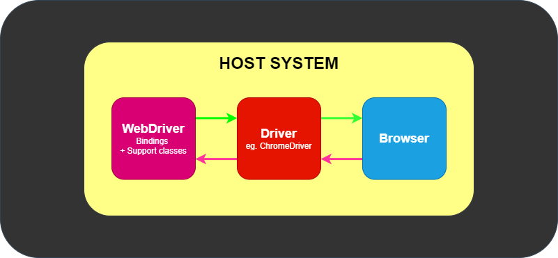

# 📚Notatki - wszystko, co warto pamiętać i z czym były problemy

## 🧰Organizacja pracy

### Rozpoczęcie pisania testów

1. Jeżeli mamy kilka serwisów do pokrycia testami, to tworzymy na nie osobne katalogi w `java` oraz `test->java`.  
   &emsp;📂src  
   &emsp;&emsp;📂main  
   &emsp;&emsp;&emsp;📂java  
   &emsp;&emsp;&emsp;&emsp;📁+ nazwa_serwisu  
   &emsp;&emsp;📂test  
   &emsp;&emsp;&emsp;📂java  
   &emsp;&emsp;&emsp;&emsp;📁+ nazwa_serwisu  
Jeżeli później będziemy używać jakichś załączników to również w katalogu `java->resources` tworzymy katalogi z nazwami naszych serwisów.
2. W katalogu `java->resources` tworzymy plik o nazwie `config.properties`.  
   Wszelkie ustawienia projektu warto trzymać i odczytywać z osobnego pliku, aby nie musieć nic zmieniać w samym kodzie.  
   Zapisujemy tam takie rzeczy jak:
   - przeglądarka
   - czy jest tryb "headless"
   - url
   - czas trwania domyślnego czekania na element
3. W głównym katalogu `java` (i katalogu serwisu) tworzymy katalog o nazwie `enums`
4. W katalogu `enums` tworzymy enum o nazwie `Browser.java`
5. Podajemy w nim nazwy przeglądarek
6. W głównym katalogu `java` (i katalogu serwisu) tworzymy katalog o nazwie `configuration`
7. W katalogu `configuration` tworzymy klasę (plik java) o nazwie `Config.java`
8. W klasie tej tworzymy:
   - mechanizm czytający i re-używający plik konfiguracyjny
   - metodę pobierającą przeglądarkę
   - metodę pobierającą url
   - metodę pobierającą czy jest tryb "headless"
   - metodę pobierającą domyślny czas czekania na element
9. W głównym katalogu `java` (w katalogu serwisu) tworzymy katalog o nazwie `pages`
10. W katalogu `pages` tworzymy katalog `base`
11. W tym katalogu `base` tworzymy klasę (plik java) o nazwie `BasePage.java`
12. Uzupełniamy naszą klasę `BasePage`:  
    (Dokładne dane będą w kodzie, tutaj tylko spis ogólny)
    - Zmieniamy na klasę abstrakcyjną
    - Definiujemy zmienne WebDriver, WebDriverWait, Actions
    - Definiujemy konstruktor
    - (opcjonalne) Definiujemy drugi konstruktor, który używa obiektu `DefaultElementLocatorFactory`
    - Definiujemy metodę konfigurującą WebDrivera
    - (opcjonalne) Możemy dodawać metody nadpisujące domyślne metody o dodatkowe logowanie wykonywanych akcji w konsoli
    - (opcjonalne) Możemy definiować metody / typy generyczne <T>
13. W głównym katalogu `java` (w katalogu serwisu) tworzymy katalog o nazwie `providers`
14. W tym katalogu `providers` tworzymy klasę (plik java) o nazwie `DriverProvider.java`
15. Tworzymy w nim `switch`, który będzie nam zmieniał przeglądarkę w zależności od ustawień
16. W tym katalogu `providers` tworzymy klasę (plik java) o nazwie `UrlProvider.java`
17. Umieszczamy w nim zmienną bazowego URL'a oraz zmienne innych URLi z jego wykorzystaniem
18. W katalogu z testami `test->java` (w katalogu serwisu) tworzymy katalog o nazwie `base`
19. W tym katalogu `base` tworzymy klasę (plik java) o nazwie `TestBase.java`
20. Ustawiamy w nim `@Before` inicjujący drivera i stronę główną oraz `@After` zamykający drivera
21. W katalogu z `pages` tworzymy katalog o nazwie `commons`. Będzie on zawierał obiekty page wspólne dla pozostałych obiektów page. Takie jak strona główna (HomePage) oraz menu strony (MenuPage) itp.
22. W tym katalogu `commos` tworzymy klasę (plik java) o nazwie `HomePage.java`
23. W `HomePage` rozszerzamy tę klasę o `...extends TestBase` i tworzymy konstruktor tej klasy nadpisujący drivera za pomocą `super` oraz dodajemy lokatory i metody
24. Dodajemy kolejny page, do którego będziemy przechodzić z naszej strony głównej. W tym przypadku będzie to `ElementsPage.java`
25. Dodajemy kolejny page, który pokryjemy pierwszymi testami o nazwie `TextBoxPage`
    - W jego metodach dodajemy na koniec `return this;` dzięki czemu będziemy mogli stosować Fluent Object Pattern
26. Tworzymy w `test->java` katalog na testy danej grupy stron `elements_tests`
27. Tworzymy klasę dla pierwszych testów `TextBoxTests`
28. Piszemy i odpalamy nasze pierwsze testy

## 📖Kod i zależności - wyjaśnienie działania

### enums

TODO

### BasePage

TODO

### providers

TODO

### TestBase

TODO

### Fluent Object Pattern

TODO

## 👨‍💻IDE

### Zapełnione miejsce na dysku systemowym (C:) przez katalog AppData

**Link:**  
https://intellij-support.jetbrains.com/hc/en-us/community/posts/360010670000-Is-it-safe-to-delete-C-Users-user-AppData-Local-JetBrains-IdeaIC2020-3-folder

Po każdej aktualizacji IDE do nowej wersji jest tworzony nowy katalog na jej dane.  
Poprzednie katalogi zostają i jak się ich nazbiera, to zajmują sporo GB.

IDE ma wbudowaną funkcję, żeby poradzić sobie z tym problemem:

1. Klikamy "hamburger menu"
2. Klikamy `Help`
3. Klikamy `Delete Leftover IDE Directories...`
4. W prawym dolnym rogu klikamy to co powiadomienie sugeruje
5. Następnie zostanie wyświetlona lista z katalogami możliwymi do usunięcia
6. Zatwierdzamy

### Formatowanie kodu

`Ctrl + Alt + L`

### Optymalizacja importów

`Ctrl + Alt + O`

### Komentarz liniowy kodu

`Ctrl + / (slash)`

### Komentarz blokowy kodu

`Ctrl + Shift + / (slash)`

### Zaznaczanie kilku linii do edycji

Żeby edytować kilka linii naraz, zaznaczamy je kombinacją klawiszy:  
`Alt + Shift + Klikanie lewym przyciskiem myszy`

### Duplikacja linii

`Ctrl + D`

## ✅Selenium

Dokumentacja: https://www.selenium.dev/documentation/

### WebDriver

Link do dokumentacji: https://www.selenium.dev/documentation/webdriver/

#### Opis

WebDriver to kompaktowy, obiektowy interfejs API, który służy do sterowania przeglądarką.  
Korzysta z interfejsów API automatyzacji przeglądarki dostarczonych przez dostawców przeglądarek w celu kontrolowania przeglądarki i uruchamiania testów.  
WebDriver nie wymaga kompilacji swojego API z kodem aplikacji, dzięki czemu nie jest to inwazyjne. Dlatego testowana jest ta sama przeglądarka, którą udostępniamy na żywo.  

#### Komunikacja

WebDriver komunikuje się z przeglądarką poprzez sterownik. Komunikacja jest dwukierunkowa: WebDriver przekazuje polecenia do przeglądarki za pośrednictwem sterownika i tą samą drogą otrzymuje informacje z powrotem.  

Sterownik jest specyficzny dla przeglądarki, np. ChromeDriver dla przeglądarki Google Chrome/Chromium, GeckoDriver dla przeglądarki Mozilla Firefox itp. Sterownik działa w tym samym systemie co przeglądarka. Może to być ten sam system, ale nie musi, w którym wykonywane są same testy.

#### Przykładowe zastosowanie WebDriver

Oto prosty przykład w języku Java, pokazujący, jak można użyć WebDriver do automatycznego otwarcia strony internetowej, wyszukania czegoś w Google i wyświetlenia wyników:
```Java
import org.openqa.selenium.By;
import org.openqa.selenium.WebDriver;
import org.openqa.selenium.WebElement;
import org.openqa.selenium.chrome.ChromeDriver;

public class SeleniumExample {
    public static void main(String[] args) {
        // Ustawienie ścieżki do sterownika Chrome
        System.setProperty("webdriver.chrome.driver", "ścieżka/do/chromedriver");

        // Inicjalizacja WebDriver
        WebDriver driver = new ChromeDriver();

        // Otwarcie strony Google
        driver.get("https://www.google.com");

        // Znalezienie pola wyszukiwania i wpisanie tekstu
        WebElement searchBox = driver.findElement(By.name("q"));
        searchBox.sendKeys("Selenium WebDriver");
        searchBox.submit();

        // Wyświetlenie tytułu strony wyników
        System.out.println("Tytuł strony: " + driver.getTitle());

        // Zamknięcie przeglądarki
        driver.quit();
    }
}
```

### @FindBy - "lokator" vs 'lokator'

Link: https://stackoverflow.com/questions/5606664/too-many-characters-in-character-literal-error

W języku C# i wychodzi na to, że w języku Java też jest tak, że:  
`myChar = '='` - pojedyncze apostrofy są dla pojedynczych znaków  
`myString = "=="` - cudzysłowie jest dla całych łańcuchów znaków

### Xpath - znajdowanie po tekście

Element "zawiera" fragment tekstu:
```Java
@FindBy(xpath = "//div[contains(@class,'card')]/h5[contains(text(), 'Alerts, Frame & Windows')]")  
private WebElement alertsFrameWindowsButton;
```

Element ma dokładnie taki tekst:
```Java
@FindBy(xpath = "//div[contains(@class,'element-list')]/ul/li/span[text()='Links']")  
private WebElement linksButton;
```

## ☕Java

Dokumentacja: https://docs.oracle.com/en/java/  
Czytelniejsze uzupełnienie: https://www.w3schools.com/java/

### Konwencja nazewnictwa katalogów package

Katalogi **package** można nazywać na dwa sposoby:  
`mojkatalog`  
`moj_katalog`

Głównie używana i zalecana jest pierwsza forma, bez podkreślnika `_`.  
Podkreślnik `_` jest zalecany, jeżeli nasza nazwa posiada w danym miejscu jakiś znak specjalny np. myślnik `-`.  
Chociaż takie sytuacje mają głównie programiści posiadający nazwy domen w package'ach.  
Jeżeli my używamy tylko zwykłych, prostych, dwu-wyrazowych nazw to używanie podkreślnika `_` nie jest żadnym problemem.  
**Źródło:** https://stackoverflow.com/questions/49890803/naming-conventions-of-composed-package-names

### Konwencja nazewnictwa klas

Nazywając pliki (klasy) java używa się konwencji PascalCase, czyli:  
`NazwaMojejKlasy`

### Konwencja nazewnictwa testów

TODO

### Klasa abstrakcyjna

Klasa abstrakcyjna w języku Java jest klasą, która nie może być bezpośrednio instancjonowana, ale może zawierać metody abstrakcyjne (bez implementacji) oraz metody konkretnie zaimplementowane. Jest to rodzaj szablonu lub podstawowej struktury, która jest przeznaczona do rozszerzenia przez inne klasy.

Oto kilka kluczowych cech klas abstrakcyjnych:

1. **Nie można tworzyć instancji:** Klasa abstrakcyjna nie może być bezpośrednio używana do tworzenia obiektów. Nie można użyć operatora `new` do instancjonowania klasy abstrakcyjnej.
2. **Może zawierać metody abstrakcyjne:** Klasa abstrakcyjna może zawierać metody abstrakcyjne, czyli metody bez implementacji, które muszą być zaimplementowane przez każdą klasę dziedziczącą po klasie abstrakcyjnej. Metody abstrakcyjne są deklarowane za pomocą słowa kluczowego `abstract` i nie mają ciała metody.
3. **Może zawierać metody konkretnie zaimplementowane:** Oprócz metod abstrakcyjnych, klasa abstrakcyjna może również zawierać metody zaimplementowane, czyli metody, które mają pełną implementację. Klasy dziedziczące po klasie abstrakcyjnej mogą korzystać z tych metod bez konieczności ich ponownej implementacji.
4. **Może zawierać pola i konstruktory:** Klasa abstrakcyjna może zawierać pola oraz konstruktory, tak jak zwykła klasa.
5. **Dziedziczenie:** Klasy abstrakcyjne mogą dziedziczyć po innych klasach abstrakcyjnych lub zwykłych klasach, a inne klasy mogą dziedziczyć po klasach abstrakcyjnych.

Klasy abstrakcyjne są często używane do definiowania ogólnej struktury lub interfejsu dla podklas, które będą je rozszerzać i dostosowywać do konkretnych potrzeb. Umożliwiają one tworzenie hierarchii klas, które są bardziej elastyczne i umożliwiają wspólne korzystanie z kodu oraz zapewnienie spójności w aplikacji.

## ⬇Markdown

Dokumentacja: https://www.markdownguide.org/basic-syntax/

### \[TAB\] Tabulator

`&emsp;`

## Pozostałe

### Przełożenie struktury projektu na tekst

**Link:**  
https://your-codes.vercel.app/how-to-easily-create-folder-structure-in-readme-with-two-simple-steps

**Potrzeba:**  
Chciałem łatwo przełożyć strukturę projektu na tekst, zamiast przepisywać ją ręcznie w notatniku.  
Dlaczego?  
Pod koniec pisania projektu chciałem zapytać czat GPT czy da się jeszcze lepiej zorganizować cały projekt tj.
porozdzielać pliki na odpowiednie pod-katalogi itp.

**Opis:**  
1. Otwieramy konsolę/terminal w naszym katalogu z projektem
   - Obojętne czy to PowerShell czy CMD, czy jeszcze inne konsole
   - Gdy otwieramy projekt w eksploratorze Windows to:
     - Wciskamy w pustym obszarze kombinację `Lewy Shift + Prawy przycisk myszy`
     - "Otwórz tutaj okno programu PowerShell"
   - Gdy mamy otwarte IDE od JetBrains to:
     - W lewym dolnym rogu, na bocznym pasku powinna być trzecia od dołu ikonka z terminalem
     - Otworzy nam ona w IDE konsolę PowerShell
2. Wpisujemy i zatwierdzamy polecenie: `tree`
3. Możemy zaznaczyć i skopiować nasze drzewo ze strukturą projektu

## 🗃Repozytorium z kursu

https://github.com/simplelogic2023szkolenie
