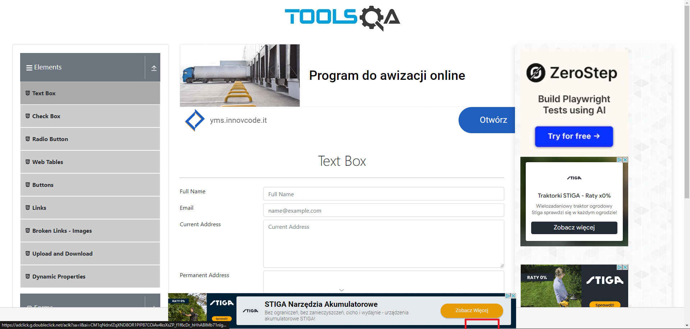
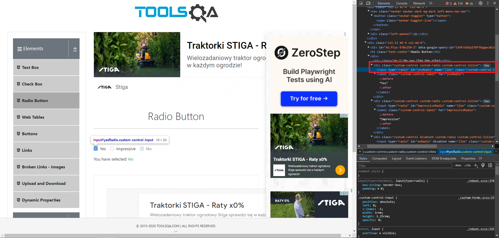
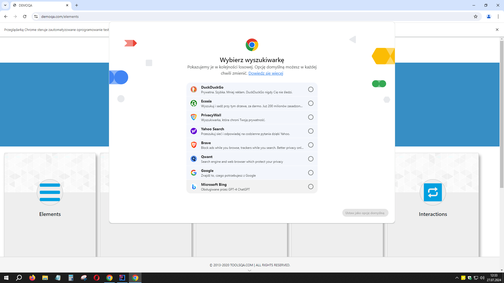
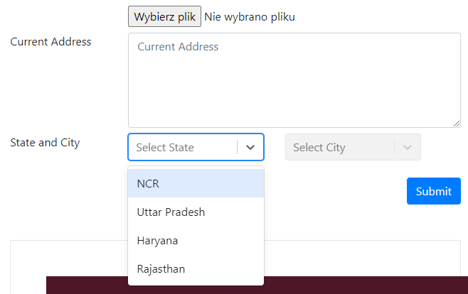
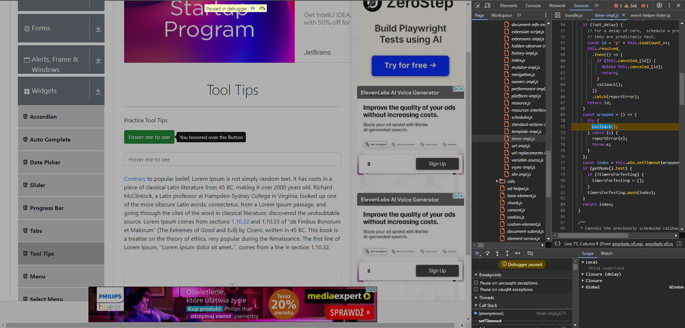
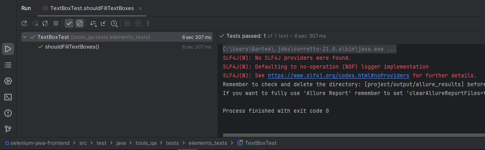

# 💥Rozwiązane problemy

## 📑Spis

- [WebElementy (przycisk) - zasłonięty przez inny element strony](#element_covered_by_another_element)
- [WebElementy - zasłonięte przez reklamę, usunięcie elementu strony](#webelement_remove)
- [WebElementy - dynamiczny lokator](#webelement_dynamic_locator)
- [Brak dostępu do prywatnego WebElementu na potrzeby Asercji w teście](#private_webelement)
- [Sprawdzanie, czy element nie jest widoczny - błąd znajdowania elementu](#assert_element_not_visible)
- [Przycisk - widoczny, ale wewnątrz innego elementu](#button_inside_other_element)
- [Przycisk - czy element jest klikalny](#button_clickable)
- [Wait - czekanie, aż element będzie zawierał określony tekst](#wait_for_text)
- [Wait — czekanie na element, który bardzo szybko i często ulega zmianom](#wait_dynamic_element_polling_every)
- [Uszkodzony obrazek / Zepsuty link](#broken_image_link)
- [Obrazek - wymiary](#image_dimensions)
- [Chrome - okno wybrania domyślnej wyszukiwarki](#chrome_search_window)
- [Select - utrzymanie rozwiniętej listy za pomocą DevTools](#select_hold_expanded)
- [Hover/ToolTip — utrzymanie widoczności za pomocą DevTools](#hover_tooltip_hold_visible)
- [Maven/Dependencies - błąd po podniesieniu wersji](#maven_dependencies_up)
- [WebElementy - czekanie na zakończenie animacji](#webelement_animation_wait)
- [Selenium — błąd CDP po aktualizacji DevTools](#selenium_devtools_cdp)
- [Warningi SLF4J — prawdopodobnie po instalacji Allure Report](#slf4j_warnings)

# 📄Opis

## WebElementy (przycisk) - zasłonięty przez inny element strony <a name="element_covered_by_another_element"></a>

**Linki:**  
[Dlaczego kliknięcia Selenium nie działają](https://www.lucidchart.com/techblog/2020/01/21/why-selenium-clicks-fail/)  
[Wait - element_to_be_clickable()](https://stackoverflow.com/questions/48665001/can-not-click-on-a-element-elementclickinterceptedexception-in-splinter-selen)  
[Jak użyć JavaScript w języku Java](https://stackoverflow.com/questions/11430773/how-to-use-javascript-with-selenium-webdriver-java)  
Dodatkowe:  
https://stackoverflow.com/questions/75412264/how-to-use-click-function-of-selenium-in-case-of-button-attribute-in-html  
https://stackoverflow.com/questions/54192441/how-to-click-link-being-covered-by-another-element-python-3-6-and-selenium

**Problem:**  
Podczas testów strony [Tools QA](https://demoqa.com/) okazało się, że wyskakujące reklamy zasłaniają przycisk **\[Submit\]**.
Przy standardowych próbach kliknięcia był zwracany błąd, że kolejny oczekiwany element po tym kliknięciu nie istnieje.
Po dodaniu *wait'a*, który miał czekać, aż element będzie klikalny, zaczął być zwracany komunikat z błędem informujący, że
element nie mógł zostać kliknięty, ponieważ został zasłonięty przez inny element (oraz wymieniono jego nazwę).


**Rozwiązanie:**  
Ostatecznie okazało się, że najlepszym sposobem jest użycie JavaScriptu, ponieważ ma on zdolność "omijania" przysłaniających
elementów strony.  
Można jego obiekt inicjować w `BasePage` dzięki czemu będziemy mieli do niego łatwiejszy dostęp, jakbyśmy musieli używać go
dla wielu metod klikających.  
Wydaje mi się, że można by próbować jeszcze zasymulować naciśniecie klawisza **\[PgDn\]**, który by przewinął całą stronę
niżej, po czym moglibyśmy kliknąć odsłonięty przycisk.

Próba 1 - użycie 'actions'

```Java
actions.moveToElement(this.submitButton).click().perform();
lub
actions.scrollToElement(this.submitButton).click().perform();
```

Próba 2 - dodanie zwykłego wait'a
```Java
driver.manage().timeouts().implicitlyWait(Duration.ofSeconds(1));
```

Próba 3 - napisanie wait'a, który czeka aż element będzie klikalny
```Java
defaultWait.until(ExpectedConditions.elementToBeClickable(this.submitButton)).click();
```

Próba 4 - użycie JavaScript

```Java
JavascriptExecutor jse = (JavascriptExecutor)driver;
jse.executeScript("arguments[0].click();", this.submitButton);
```

---

## WebElementy - zasłonięte przez reklamę, usunięcie elementu strony <a name="webelement_remove"></a>

**Linki:**  
https://stackoverflow.com/questions/70222166/how-do-i-remove-an-element-in-selenium-python

**Problem:**  
Podczas testów strony [Tools QA](https://demoqa.com/) okazało się, że wyskakująca reklama na dole strony blokuje wszystkie
przyciski na każdej pod-stronie. Samo omijanie tego tak jak to zrobiono w punkcie wyżej, nie wystarczyło.


**Rozwiązanie:**  
Postanowiłem usuwać tego DIV'a przy każdym wejściu na tę stronę.  
Użyłem poniższego kodu:  
```Java
jse.executeScript("arguments[0].remove();", adFrame);
```

---

## WebElementy - dynamiczny lokator <a name="webelement_dynamic_locator"></a>

**Problem:**  
Na stronie zamiast pola typu `Select` był DIV, który rozwijał listę DIV'ów.  
Po kliknięciu w niego każdy element miał inny tekst i tylko po tekście można było wybrać dany element z listy.  

**Rozwiązanie:**  
Zrodził się z tego pomysł na "dynamiczny lokator" do którego po prostu byłby podstawiany dany tekst.

Najpierw musimy główny lokator zapisać jako String.  
Dlaczego tak?  
Ponieważ do lokatora zadeklarowanego w adnotacji `@FindBy` nie ma dostępu oraz nie da się go przerobić na String.  
Lokator umieszczony w tej adnotacji jest tworzony dopiero podczas uruchamiania testu z nim związanego.  
Zapisałem to w taki sposób:  
```JAVA
// State and City
private final String stateSelectXpath = "//div[@id='state']";
@FindBy(xpath = stateSelectXpath)
private WebElement stateSelect;
```

Następnie w metodzie dorobiłem do tego tworzenie "dynamicznego lokatora":  
```JAVA
// State and City

public PracticeFormPage selectState(String state) {
    stateSelect.click();
    String stateSelectOptionXpath = stateSelectXpath + "//div[text()='" + state + "']";
    WebElement stateSelectOptionLocator = driver.findElement(By.xpath(stateSelectOptionXpath));
    WebElement stateSelectOption = defaultWait.until(ExpectedConditions.elementToBeClickable(stateSelectOptionLocator));
    stateSelectOption.click();
    return this;
}
```

**Wyjaśnienie:**
- Najpierw klikamy w główny lokator rozwijający pole z listą elementów.
- Następnie tworzymy nowy String pod lokator dla jednego z elementów listy. Podstawiamy tutaj jako tekst nazwę jednego
z elementów listy
- Następnie deklarujemy ten nowy lokator jako WebElement używając standardowej składni `driver.findElement(By...)`
podstawiając nasz String pod ścieżkę Xpath tego nowego lokatora
- Dodajemy "wait" czekający, aż elementy z listy zostaną wyświetlone (będą klikalne)
- Klikamy na jeden z elementów listy

---

## Brak dostępu do prywatnego WebElementu na potrzeby Asercji w teście <a name="private_webelement"></a>

**Linki:**  
https://www.w3schools.com/java/java_encapsulation.asp

**Problem:**  
Pisząc testy, trzymałem się założenia, że asercje powinny być w testach, a nie w metodach page'y.
Gdy chciałem w teście sprawdzić stan danego WebElementu to nie mogłem tego zrobić, ponieważ w klasie Page został on
zadeklarowany jako prywatny.

**Rozwiązanie:**  
Rozwiązaniem tego okazało się napisanie Gettera:
```Java
Klasa z Page:
@FindBy(css = "label[for='tree-node-home'] input")
private WebElement assertHomeCheckBox;

public WebElement getAssertHomeCheckBox() {
    return assertHomeCheckBox;
}

Klasa z testem:
assertThat(checkBoxPage.getAssertHomeCheckBox().isSelected()).isTrue();
```

---

## Sprawdzanie, czy element nie jest widoczny - błąd znajdowania elementu <a name="assert_element_not_visible"></a>

**Linki:**  
https://stackoverflow.com/a/62684271

**Problem:**  
W teście chciałem sprawdzić, czy dany element nie jest już widoczny.  
Asercja, która to miała sprawdzać, zwracała błąd, ponieważ już na początkowym etapie WebElement nie był odnajdywany.

**Rozwiązanie:**  
Rozwiązaniem tego było napisanie takiej, ogólnodostępnej funkcji:
```Java
public class WebElementMethods {

    public boolean isElementPresent(WebElement webElement) {
        try{
            webElement.isDisplayed();
            return true;
        }
        catch(NoSuchElementException e){
            return false;
        }
    };
}

Asercja w teście:
assertThat(webElementMethods.isElementPresent(desktopCheckBox)).isFalse();
```

---

## Przycisk - widoczny, ale wewnątrz innego elementu <a name="button_inside_other_element"></a>

**Linki:**  
https://stackoverflow.com/a/19763087

**Problem:**  
Przycisk jest widoczny na stronie, ale znajduje się wewnątrz innego elementu, przez co jest "przysłonięty" wewnątrz kodu strony.


**Rozwiązanie:**  
Jeżeli przycisk jest **widoczny** na stronie, ale znajduje się wewnątrz innego elementu to można użyć `Actions`:
```Java
public RadioButtonPage clickYesRadioButton() {
    actions.moveToElement(this.yesRadioButton).click().perform();
    return this;
}
```

---

## Przycisk - czy element jest klikalny <a name="button_clickable"></a>

**Problem:**  
Przy próbie kliknięcia przycisku, który nie jest klikalny, zwracany jest błąd.  


**Rozwiązanie:**  
Żeby takie coś sprawdzać, warto napisać i stosować poniższą metodę:
```Java
public boolean isElementClickable(WebElement webElement) {
    try {
        actions.moveToElement(webElement).click().perform();
        return true;
    } catch (JsonException e) {
        return false;
    }
}

Test:
assertThat(webElementMethods.isElementClickable(noRadioButton)).isFalse();
```

Jeżeli powyższa metoda stwierdza, że element jest klikalny, mimo że nie jest, to można spróbować w niego kliknąć, złapać
wyjątek, z którym nic nie będziemy robić i spróbować sprawdzić, czy jakiś jego atrybut nie informuje nas o tym, czy dany
element jest zaznaczony/kliknięty/aktywny, czy nie:
```Java
public TabsPage clickMoreTab() {
    try {
        moreTabButton.click();
    } catch (ElementClickInterceptedException e) {
    }
    return this;
}

assertThat(tabsPage.getMoreTabButton().getAttribute("aria-selected")).isEqualTo("false");
```

---

## Wait - czekanie, aż element będzie zawierał określony tekst <a name="wait_for_text"></a>

**Linki:**  
https://www.browserstack.com/guide/wait-commands-in-selenium-webdriver

**Problem:**  
Na stronie: https://demoqa.com/links  
Podczas klikania na linki z sekcji API call test się wywalał, ponieważ napis po kliknięciu zmieniał się wolniej,
niż leciał test.

**Rozwiązanie:**  
Wstępnie metoda `Thread.sleep(1000)` pomogła, ale że nie jest to zalecany sposób, użyłem czegoś innego.  
Tzw. **ExpectedConditions** zawierają metody czekające na określone warunki dla elementu. Pełna lista w linku.  
Poniższa metoda "czeka", aż element będzie zawierał określony przez nas tekst:
```Java
defaultWait.until(ExpectedConditions.textToBePresentInElement(linkResponseMessage, expectedText));
```

---

## Wait — czekanie na element, który bardzo szybko i często ulega zmianom <a name="wait_dynamic_element_polling_every"></a>

**Linki:**  
https://youtu.be/X21PIW3UKAY?si=Kh3vD_rOdM6BAC5j&t=737

**Problem:**  
Na stronie: https://demoqa.com/progress-bar  
Znajduje się progress bar, którego wartość rosła bardzo szybko po uruchomieniu.  
Nie działał żaden standardowy `wait`.

**Rozwiązanie:**  
Do metody, która czeka, aż progress bar osiągnie oczekiwaną przez nas wartość, należało dodać `pollingEvery()`.  
Definiuje ona interwał, w jakim Selenium będzie sprawdzać, czy dany warunek został spełniony.
```Java
defaultWait.pollingEvery(Duration.ofMillis(1));
```
Więcej o tej metodzie w README dotyczącym Selenium i testów.  
Zastosowanie w metodzie:
```Java
public ProgressBarPage waitForProgressBar(String expectedValue) {
    defaultWait.pollingEvery(Duration.ofMillis(1));
    defaultWait.until(ExpectedConditions.attributeToBe(progressBar, "aria-valuenow", expectedValue));
    return this;
}
```

---

## Uszkodzony obrazek / Zepsuty link <a name="broken_image_link"></a>

**Problem:**  
Jak sprawdzić, czy obrazek lub link jest zepsuty?

**Rozwiązanie:**  
W Selenium nie da się za bardzo sprawdzać, czy dany obrazek lub link jest zepsuty.  
W rozwiązaniu tego problemu pomogła poniższa metoda:
```Java
public int getHttpStatus(WebElement webElement, String attributeName) {
    int responseCode = 0;
    try {
        String elementUrl = webElement.getAttribute(attributeName);
        URL url = new URI(elementUrl).toURL();
        HttpURLConnection connection = (HttpURLConnection) url.openConnection();
        connection.setRequestMethod("HEAD");
        responseCode = connection.getResponseCode();
    } catch (Exception e) {
        System.out.println("An error occurred while retrieving the HTTP status of Web Element");
    }
    return responseCode;
}
```
Łączy się przez adres URL danego elementu i zwraca jego status code, który w teście możemy porównać z oczekiwanym.  
Przykład użycia w teście:
```Java
int responseCode = brokenLinksImagesPage.getHttpStatus(brokenImage, "src");
assertThat(responseCode).isEqualTo(200);
```

---

## Obrazek - wymiary <a name="image_dimensions"></a>

**Problem:**  
Jak pobrać wymiary obrazka, żeby je sprawdzić?

**Rozwiązanie:**  
Żeby pobrać wymiary obrazka, trzeba użyć JavascriptExecutor:
```Java
public int getImageWidth(WebElement webElement) {
    return ((Long) jse.executeScript("return arguments[0].naturalWidth;", webElement)).intValue();
}

public int getImageHeight(WebElement webElement) {
    return ((Long) jse.executeScript("return arguments[0].naturalHeight", webElement)).intValue();
}
```
Użycie w teście:
```Java
int actualImageWidth = brokenLinksImagesPage.getImageWidth(brokenImage);
int actualImageHeight = brokenLinksImagesPage.getImageHeight(brokenImage);

assertThat(actualImageWidth).isEqualTo(expectedImageWidth);
assertThat(actualImageHeight).isEqualTo(expectedImageHeight);
```

---

## Chrome - okno wybrania domyślnej wyszukiwarki <a name="chrome_search_window"></a>

**Linki:**  
https://stackoverflow.com/questions/78787332/selecting-default-search-engine-is-needed-for-chrome-version-127

**Problem:**  
Od wersji 127, przy każdym uruchamianym teście na środku okna z przeglądarką, było wyświetlane okno wybrania domyślnej wyszukiwarki:


**Rozwiązanie:**  
Do opcji ChromeDrivera należy dodać:
```Java
options.addArguments("--disable-search-engine-choice-screen");
```

---

## Select - utrzymanie rozwiniętej listy za pomocą DevTools <a name="select_hold_expanded"></a>

**Linki:**  
https://dev.to/kildareflare/inspect-disappearing-element-e-g-dropdown-menus-1khi

**Problem:**  
Podczas pisania testów nie dało się sprawdzić selektorów rozwiniętego pola typu select.  
Po rozwinięciu select'a i kliknięciu w DevToolsy na ten element rozwinięta lista tego select'a znikała.


**Rozwiązanie:**  
1. Otwieramy `DevTools`
2. Zaznaczamy element, który jest rozwijanym Select'em
3. W dolnej sekcji, gdzie wyświetlane są Style przełączamy się na zakładkę `Event Listeners`
4. Rozwijamy parametr `blur`
5. Klikamy po kolei ikonkę kosza na znajdujących się tam elementach i sprawdzamy, czy wartości select'a już się nie chowają

---

## Hover/ToolTip — utrzymanie widoczności za pomocą DevTools <a name="hover_tooltip_hold_visible"></a>

**Linki:**  
https://stackoverflow.com/a/38650137

**Problem:**  
Podczas pisania testów nie dało się sprawdzić wyświetlanego tooltipa.  
Po najechaniu myszką na element i kliknięciu w DevToolsy tooltip znikał.


**Rozwiązanie:**
1. Otwieramy `DevTools`
2. Najeżdżamy na element, który ma wyświetlić tooltip
3. Wciskamy klawisz F8
4. Ruszamy myszką, żeby zobaczyć czy pauza w debugerze została uruchomiona, jeśli nie to powtarzamy proces
5. Ewentualnie otwieramy zakładkę \[Sources\] i wtedy wciskamy F8

---

## Maven/Dependencies - błąd po podniesieniu wersji <a name="maven_dependencies_up"></a>

**Problem:**  
Po podniesieniu wersji wszystkich możliwych dependencies w Maven przy uruchamianiu testu w Selenium zaczął pojawiać się
poniższy błąd:  
`java.lang.NoClassDefFoundError: org/openqa/selenium/support/pagefactory/ElementLocatorFactory`

**Rozwiązanie:**  
Pomogło wyłączenie i włączenie IDE ponownie.

---

## WebElementy - czekanie na zakończenie animacji <a name="webelement_animation_wait"></a>

**Problem:**  
Czasami Selenium szybciej zamykało okno modalne, nim zdążyło się ono w pełni pojawić.  
Ta dziwna sytuacja wywoływała błąd:  
`StaleElementReferenceException: stale element reference: stale element not found in the current frame`  
Selenium próbował odwoływać się do elementu, którego już nie było.

**Rozwiązanie:**  
Żeby zaczekać, aż dany element lub animacja przestaną się poruszać można użyć poniższej metody:  
```Java
public void waitForElementToStopMoving(WebElement webElement) {
    Point initialLocation = webElement.getLocation();
    while (true) {
        try {
            Thread.sleep(100);
        } catch (InterruptedException e) {
            Thread.currentThread().interrupt();
        }
        Point finalLocation = webElement.getLocation();
        if (initialLocation.equals(finalLocation)) {
            break;
        }
        initialLocation = finalLocation;
    }
}
```

---

## Selenium — błąd CDP po aktualizacji DevTools <a name="selenium_devtools_cdp"></a>

**Link do wątku na ten temat:**  
https://github.com/SeleniumHQ/selenium/issues/14630#issue-2601723082

**Problem:**  

Co jakiś czas narzędzia developerskie `DevTools` mają aktualizacje.  
Po takiej aktualizacji, gdy uruchamiamy testy w **Selenium**, może pojawiać się poniższy błąd:
```Java
lis 22, 2024 6:29:52 PM org.openqa.selenium.devtools.CdpVersionFinder findNearestMatch
WARNING: Unable to find an exact match for CDP version 131, returning the closest version; found: 130; Please update to a Selenium version that supports CDP version 131
```
Czasami mimo tego błędu Selenium działa, a czasami nie.  
Prawdopodobnie zależy to od tego jak duża była aktualizacja i na jakie elementy mogła mieć wpływ.

**Rozwiązanie:**  

Głównym rozwiązaniem problemu jest czekanie, aż twórcy zastosują nową wersję `DevTools` w **Selenium** i wypuszczą
kolejną aktualizację/wersję do podniesienia w **Maven**.  
Niestety czekanie może długo potrwać, ponieważ osoby zaangażowane w rozwój Selenium robią to za darmo w swoim wolnym
czasie.

W linku wyżej na GitHub inni użytkownicy zaproponowali dwa tymczasowe obejścia:
1. Instalacja wersji przeglądarki sprzed aktualizacji  
   (Nie jestem pewien czy chodzi o przeglądarkę na komputerze, czy może Driver)
   - Odinstalowujemy nasz najnowszy, zaktualizowany Google Chrome
   - Pobieramy i instalujemy starszą wersję, która zawiera taką wersję `DevTools`, jaką obsługuje nasze **Selenium**
   - Przykładowy link:
     https://www.filepuma.com/download/google_chrome_64bit_129.0.6668.101-41911/
2. Użycie **Selenium Manager** i/lub może **WebDriverManager**  
   (Nie zagłębiałem się dokładnie w ten temat, ale można przeczytać poniższe linki, gdy zajdzie taka potrzeba)
   - Dokumentacja **Selenium Manager**:
     https://www.selenium.dev/documentation/selenium_manager/
   - Dokumentacja **WebDriverManager**:
     https://bonigarcia.dev/webdrivermanager/#webdrivermanager-and-selenium-manager

## Warningi SLF4J — prawdopodobnie po instalacji Allure Report <a name="slf4j_warnings"></a>

**Linki:**  
Maven: https://mvnrepository.com/artifact/ch.qos.logback/logback-classic/1.5.16  
Dokumentacja: https://logback.qos.ch/manual/configuration.html  
Poradnik: https://www.baeldung.com/logback

**Problem:**  

Po instalacji **Allure Report** po każdym uruchomieniu testów zaczęły w konsoli pojawiać się poniższe warningi:  
```
SLF4J(W): No SLF4J providers were found.
SLF4J(W): Defaulting to no-operation (NOP) logger implementation
SLF4J(W): See https://www.slf4j.org/codes.html#noProviders for further details.
```



Nie robią one nic złego, ale mogą denerwować.

Te warningi oznaczają, że biblioteka **SLF4J (Simple Logging Facade for Java)** została poprawnie dodana do projektu,
ale brak jest odpowiedniego providera (implementacji logowania), który obsługiwałby wywołania logowania.

SLF4J działa jako interfejs dla różnych frameworków logowania, takich jak Logback, Log4j, czy java.util.logging.
Jeśli nie dostarczysz implementacji logowania, SLF4J domyślnie przełącza się na "NOP" (no-operation), co oznacza,
że wszystkie komunikaty logowania będą ignorowane.

**Rozwiązanie:**

1. Musimy dodać odpowiedni provider do swojego projektu:  
   Wybierz implementację logowania, której chcesz używać (np. **Logback**, **Log4j**, **java.util.logging**) i dodaj ją
   do swojego menedżera zależności (np. Maven, Gradle). Najczęściej stosowaną implementacją jest **Logback**.
   - W repozytorium Maven wyszukujemy **Logback Classic**
   - Link: https://mvnrepository.com/artifact/ch.qos.logback/logback-classic/1.5.16
   - Dodajemy do naszego `pom.xml`
   - Przeładowujemy projekt
2. Inicjujemy konfigurację logowania:
   - W przypadku korzystania z **Logback** gdzieś w katalogu `resources` tworzymy plik `logback.xml`
   - Wklejamy w niego poniższą konfigurację i zapisujemy:  
     ```xml
     <configuration>
         <appender name="STDOUT" class="ch.qos.logback.core.ConsoleAppender">
             <encoder>
                 <pattern>%d{yyyy-MM-dd HH:mm:ss} [%thread] %-5level %logger{36} - %msg%n</pattern>
             </encoder>
         </appender>
     
         <root level="debug">
             <appender-ref ref="STDOUT"/>
         </root>
     </configuration>
     ```
3. Sprawdzamy, czy **SLF4J** jest prawidłowo skonfigurowane:
   - Uruchamiamy ponownie jakiś test
   - Warningi powinny zniknąć, a logi zaczną być wyświetlane na konsoli (lub w plikach, w zależności od konfiguracji).

**Komentarz:**

Jeśli nie planujesz używać logowania, możesz po prostu zignorować te warningi, ale jeśli w przyszłości będziesz
potrzebować logowania, najlepiej skonfigurować jedną z popularnych implementacji.  
Jeśli chcesz pozbyć się warningów bez dodawania providera, usuń zależność SLF4J z projektu (niezalecane w przypadku
bibliotek, które wymagają logowania).
