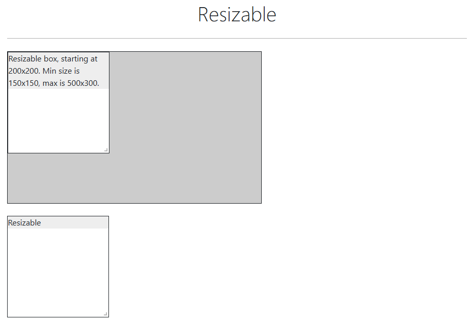
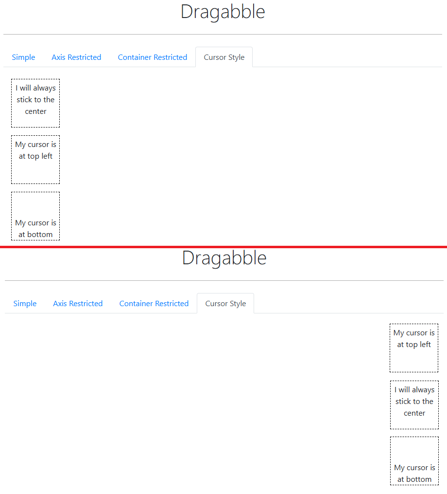

# ✅Selenium i testy — notatki

## 📑Spis treści

- [CSS — Sprawdzenie atrybutu elementu np. kolor](#css_color)
- [WebElement — Sprawdzanie, czy nie ma elementu na stronie](#assert_no_element)
- [Wzorzec Arrange-Act-Assert](#AAA)
- [Pobieranie plików](#pobieranie)
- [Logowanie - pozostanie zalogowanym pomiędzy testami](#logowanie_sesja_cookies)
- [Slider — metody](#slider_methods)
- [Wait — pollingEvery()](#wait_polling_every)
- [Resize — zmiana wielkości pól tekstowych i innych, podobnych elementów](#resize_text_area)
- [Drag And Drop — Przesuwanie elementów do konkretnego miejsca na stronie](#drag_and_drop_to_set_location)
- [JUnit — ustawianie kolejności odpalania testów](#junit_test_order)
- [Logowanie/Sesja — zapamiętanie zalogowania za pomocą cookies na różne sposoby](#login_session_cookies)

---

## CSS — Sprawdzenie atrybutu elementu np. kolor <a name="css_color"></a>

### Opis

**Gdy:** Chcemy sprawdzić, czy np. pole ma określony kolor  
**To:**

Używamy na elemencie poniższej metody, a w nawiasie jako argument podajemy nazwę atrybutu:
```Java
element.getCssValue("border-color");
```

Przykład w teście:
```Java
String cssValue = "border-color";
String colorRedRGB = "rgb(220, 53, 69)";
String colorGreenRGB = "rgb(40, 167, 69)";

assertThat(practiceFormPage.getFirstNameInput().getCssValue(cssValue)).isEqualTo(colorRedRGB);
assertThat(practiceFormPage.getEmailInput().getCssValue(cssValue)).isEqualTo(colorGreenRGB);
```

---

## WebElement — Sprawdzanie, czy nie ma elementu na stronie <a name="assert_no_element"></a>

### Opis

**Gdy:** Chcemy sprawdzić na końcu testu asercją czy danego elementu nie ma na stronie  
**To:**
1. W pliku z `Page` przypisujemy selektor tego elementu do listy elementów (zamiast do pojedynczego WebElementu):
   ```Java
    @FindBy(css = ".subjects-auto-complete__indicators .subjects-auto-complete__indicator")
    private List<WebElement> subjectsAutoCompleteInputClearButton;
   ```
2. W pliku z `Page` tworzymy "Gettera" do tego elementu:
   ```Java
   public List<WebElement> getSubjectsAutoCompleteInputClearButton() {
       return subjectsAutoCompleteInputClearButton;
   }
   ```
3. Następnie w pliku z `testem` sprawdzamy asercją, czy ta lista WebElementów jest pusta:
   ```Java
   assertThat(practiceFormPage.getSubjectsAutoCompleteInputClearButton()).isEmpty();
   ```
**Dlaczego tak?**  
Ponieważ jak zrobimy z tego zwykły WebElement to Selenium rzuci błąd, że nie może takiego elementu znaleźć (bo go nie ma).  
A tak, dzięki temu sposobowi będzie to lepiej sprawdzane.

---

## Wzorzec Arrange-Act-Assert <a name="AAA"></a>

**Linki:**  
https://automationpanda.com/2020/07/07/arrange-act-assert-a-pattern-for-writing-good-tests/

### Opis

Wzorzec *Arrange-Act-Assert* to świetny sposób na ustrukturyzowanie przypadków testowych.  
Określa kolejność operacji:
1. **Arrange — Uporządkuj** dane wejściowe i cele.  
Może zawierać:
   - Zmienne
   - Obiekty
   - Ustawienia
   - Dane / Przygotowanie bazy danych
   - Zalogowanie się do aplikacji
2. **Act — Działaj** zgodnie z zachowaniem docelowym.  
Składa się z kroków, podczas których wykonywany jest test.  
Może zawierać:
    - Wywoływane metody / funkcje
    - Wywołanie interfejsu API REST
    - Interakcje ze stroną internetową
3. **Assert — Potwierdź** oczekiwane wyniki.  
Wcześniej wykonane kroki powinny wywołać jakiś rodzaj odpowiedzi.  
Asercje te ostatecznie mają określać czy test zostanie zaliczony, czy nie.  
Może zawierać:
    - Asercje sprawdzające, czy otrzymany zestaw danych jest zgodny z oczekiwanym
    - Inne elementy, które mają sprawdzać wiele aspektów systemu

### Ciekawostka

*Behavior-Driven Development* podąża za wzorcem *Arrange-Act-Assert* pod inną nazwą: **Given-When-Then**.
Język Gherkin używa kroków *Given-When-Then* do określania zachowań w scenariuszach. *Given-When-Then* jest zasadniczo
tym samym wzorem co *Arrange-Act-Assert*.

### Przykład

Przykład z internetu:
```Python
import requests
 
def test_duckduckgo_instant_answer_api_search():
 
  # Arrange
  url = 'https://api.duckduckgo.com/?q=python+programming&format=json'
   
  # Act
  response = requests.get(url)
  body = response.json()
   
  # Assert
  assert response.status_code == 200
  assert 'Python' in body['AbstractText']
```

Przykład używany przeze mnie:
```Java
@Test
public void shouldOpenHomeLinkInNewTab() {

    // -------
    // ARRANGE
    // -------

    String expectedUrl = "https://demoqa.com/";

    // ---
    // ACT
    // ---

    new HomePage(driver)
            .goToElementsPage()
            .removeAdFrameAndFooter()
            .goToLinksPage()
            .clickNewTabHomeLink()
            .switchTab(1);

    // ------
    // ASSERT
    // ------

    assertThat(driver.getCurrentUrl()).isEqualTo(expectedUrl);
}
```

---

## Pobieranie plików <a name="pobieranie"></a>

**Uwaga:** Warto nazwy pobieranych plików lub katalog z nimi dodać do pliku `.gitignore`

1. W pliku `config.properties` podajemy ścieżkę, do której będą zapisywane pliki w ramach naszych testów:
   ```Java
   downloadFilePath=E:\\Nauka\\Projekty\\selenium-java-frontend\\src\\main\\resources\\tools_qa
   ```
2. W piku `Config.java` tworzymy metodę, która będzie pobierać ścieżkę z pliku konfiguracyjnego:
   ```Java
   public static String getDownloadFilePath() {
        return properties.getProperty("downloadFilePath");
   }
   ```
3. W pliku `DriverProvider.java`:
   - Dopisujemy do metody nowy argument:
   ```Java
   public static WebDriver getDriver(Browser browser, String downloadFilePath) {}
   ```
   - W miejscu, gdzie jest wybierany i konfigurowany nasz **ChromeDriver** dopisujemy poniższe opcje:
   ```Java
   Map<String, Object> prefs = new HashMap<>();
   prefs.put("download.default_directory", downloadFilePath);
   prefs.put("download.prompt_for_download", false);
   // To disable Chrome PDF viewer we should write this:
   // prefs.put("plugins.always_open_pdf_externally", true);
   options.setExperimentalOption("prefs", prefs);
   ```
4. W pliku `TestBase.java` do metody `setUp()` dopisujemy drugi argument `Config.getDownloadFilePath()`:
   ```Java
   @BeforeEach
   public void setUp() {
        driver = DriverProvider.getDriver(Config.getBrowser(), Config.getDownloadFilePath());
        driver.get(UrlProvider.homePage);
   }
   ```
   Metoda z klasy Config pobiera ścieżkę pobierania z pliku konfiguracyjnego i wkleja ją tutaj jako String.
5. W pliku page `UploadAndDownloadPage.java`:
   - Tworzymy metodę klikającą przycisk pobierania
   ```Java
   public UploadAndDownloadPage clickDownloadButton() {
        downloadButton.click();
        return this;
   }
   ```
   - Tworzymy metodę sprawdzającą i czekającą, aż plik zostanie pobrany
   ```Java
   private static Path waitForFileDownload(String downloadDir, String expectedFileName, int timeoutInSeconds) throws InterruptedException {
        Path filePath = Paths.get(downloadDir, expectedFileName);
        for (int i = 0; i < timeoutInSeconds; i++) {
            if (Files.exists(filePath)) {
                return filePath;
            }
            Thread.sleep(1000);
        }
        return null;
   }
   ```
   - Tworzymy metodę, która używa poprzedniej metody oraz sprawdza, czy plik o podanej nazwie istnieje i zwraca nam jego nazwę
   ```Java
   public Path downloadFile(String downloadFilePath, String expectedFileName, int timeoutInSeconds) throws InterruptedException {
        try {
            Path downloadedFile = waitForFileDownload(downloadFilePath, expectedFileName, timeoutInSeconds);
            return downloadedFile;
        } catch (Exception e) {
            e.printStackTrace();
            throw new RuntimeException("Plik nie został pobrany");
        }
   }
   ```
   - Tworzymy metodę, która kasuje pobrany plik po zakończeniu testów
   ```Java
   public void deleteDownloadedFile(Path filePath) {
        try {
            if (Files.exists(filePath)) {
                Files.delete(filePath);
            }
        } catch (Exception e) {
            e.printStackTrace();
        }
   }
   ```
6. W pliku z testem `UploadAndDownloadTest.java`:
   - Podmieniamy ścieżkę pobierania na jakąś inną (jeśli chcemy) definiując ją w zmiennych klasy z testami
   ```Java
   String generalDownloadPath = Config.getDownloadFilePath();
   String downloadDir = "\\UploadAndDownload";
   String downloadPath = generalDownloadPath + downloadDir;
   ```
   - Nadpisujemy metodę `setUp()` podając w niej naszą nową ścieżkę pobierania pliku
   ```Java
   @Override
   @BeforeEach
   public void setUp() {
        driver = DriverProvider.getDriver(Config.getBrowser(), downloadPath);
        driver.get(UrlProvider.homePage);
   }
   ```
   - Piszemy nasz test
     - Klikamy przycisk pobierania
     - Sprawdzamy, czy plik się pobrał i znajduje się w katalogu
     - Dodatkową asercją sprawdzamy, czy plik istnieje
     - Kasujemy pobrany plik
     ```Java
     @Test
     public void shouldDownloadFile() throws InterruptedException {

        // -------
        // ARRANGE
        // -------

        UploadAndDownloadPage uploadAndDownloadPage = new UploadAndDownloadPage(driver);

        // ---
        // ACT
        // ---

        new HomePage(driver)
                .goToElementsPage()
                .removeAdFrameAndFooter()
                .goToUploadAndDownloadPage()
                .clickDownloadButton();

        Path downloadedFile = uploadAndDownloadPage.downloadFile(downloadPath, "sampleFile.jpeg", 5);

        // ------
        // ASSERT
        // ------

        assertThat(Files.exists(downloadedFile)).isTrue();

        // -----------
        // DELETE FILE
        // -----------

        uploadAndDownloadPage.deleteDownloadedFile(downloadedFile);
     }
     ```

---

## Logowanie - pozostanie zalogowanym pomiędzy testami <a name="logowanie_sesja_cookies"></a>


Gdy masz dużo testów napisanych w Selenium, a wiele z nich wymaga logowania, możesz zoptymalizować proces testowania,
eliminując konieczność logowania w każdym teście. Oto kilka strategii, które możesz zastosować:

### 1. Używanie plików cookies po zalogowaniu

Jednym z najprostszych sposobów na ominięcie etapu logowania jest zapisanie plików cookies po zalogowaniu i późniejsze
ich ponowne użycie w każdym teście. Pliki cookies przechowują informacje o sesji, dzięki czemu Selenium nie musi
przechodzić przez cały proces logowania.

**Kroki:**
- Zaloguj się raz przy użyciu Selenium i zapisz pliki cookies.
- Przy każdym teście wczytaj zapisane cookies, aby automatycznie zalogować użytkownika.

**Przykład w Java:**
1. Zapisywanie cookies po zalogowaniu:
   ```Java
   public void saveCookies(WebDriver driver) {
       Set<Cookie> cookies = driver.manage().getCookies();
       // Zapisz cookies do pliku
       try (FileWriter fileWriter = new FileWriter("cookies.data")) {
           for (Cookie cookie : cookies) {
               fileWriter.write(cookie.getName() + ";" + cookie.getValue() + ";" 
                   + cookie.getDomain() + ";" + cookie.getPath() + ";" 
                   + cookie.getExpiry() + ";" + cookie.isSecure() + "\n");
           }
       } catch (IOException e) {
           e.printStackTrace();
       }
   }
   ```
2. Wczytywanie cookies przed testami:
   ```Java
   public void loadCookies(WebDriver driver) {
       try (BufferedReader bufferedReader = new BufferedReader(new FileReader("cookies.data"))) {
           String line;
           while ((line = bufferedReader.readLine()) != null) {
               String[] token = line.split(";");
               Cookie cookie = new Cookie.Builder(token[0], token[1])
                       .domain(token[2])
                       .path(token[3])
                       .expiresOn(null) // lub ustaw datę wygaśnięcia
                       .isSecure(Boolean.parseBoolean(token[5]))
                       .build();
               driver.manage().addCookie(cookie);
           }
       } catch (IOException e) {
           e.printStackTrace();
       }
       driver.navigate().refresh(); // Odśwież stronę, aby zastosować cookies
   }
   ```

### 2. Zautomatyzowane API logowania

Jeśli aplikacja, którą testujesz, oferuje API logowania, możesz zautomatyzować proces uzyskania tokenu autoryzacyjnego
lub sesji bez przechodzenia przez pełny interfejs użytkownika. Następnie wstrzykujesz sesję do przeglądarki.

**Kroki:**
- Użyj zapytania HTTP w celu zalogowania się do aplikacji.
- Uzyskaj token lub sesję.
- Ustaw nagłówki lub pliki cookies w przeglądarce Selenium.

**Przykład w Java:**
```Java
// Przykład użycia HTTP Clienta do uzyskania tokenu logowania
public String getAuthToken() {
    HttpClient client = HttpClient.newHttpClient();
    HttpRequest request = HttpRequest.newBuilder()
        .uri(URI.create("https://example.com/api/login"))
        .header("Content-Type", "application/json")
        .POST(HttpRequest.BodyPublishers.ofString("{\"username\":\"user\", \"password\":\"pass\"}"))
        .build();

    HttpResponse<String> response = client.send(request, HttpResponse.BodyHandlers.ofString());
    return extractTokenFromResponse(response.body()); // Wydobycie tokenu z odpowiedzi
}

// Ustaw token w nagłówku Selenium
public void setTokenInBrowser(WebDriver driver, String token) {
    JavascriptExecutor js = (JavascriptExecutor) driver;
    js.executeScript("window.localStorage.setItem('authToken', '" + token + "');");
    driver.navigate().refresh();
}
```

### 3. Użycie sesji z poprzednich testów

Jeśli testy są wykonywane w tej samej sesji przeglądarki, możesz utrzymać stan przeglądarki pomiędzy testami, co
eliminuje konieczność ponownego logowania.

**Kroki:**
- Uruchom Selenium w jednej sesji.
- Nie zamykaj przeglądarki pomiędzy testami.

**Przykład konfiguracji w TestNG:**
```Java
@BeforeClass
public void setUp() {
    // Uruchom WebDriver raz, dla całej klasy testowej
    driver = new ChromeDriver();
    driver.get("https://example.com");
    login(); // Zaloguj raz
}

@AfterClass
public void tearDown() {
    driver.quit(); // Zamknij przeglądarkę na końcu wszystkich testów
}
```

### 4. Utrzymywanie stanu przeglądarki pomiędzy uruchomieniami (profile przeglądarki)

Możesz używać profilów przeglądarki (np. dla Chrome lub Firefox), które przechowują sesję użytkownika.

**Kroki:**
- Uruchom przeglądarkę z zachowaniem profilu użytkownika, aby stan sesji został zachowany między uruchomieniami Selenium.

**Przykład dla Chrome:**
```Java
ChromeOptions options = new ChromeOptions();
options.addArguments("user-data-dir=/path/to/your/custom/profile");
WebDriver driver = new ChromeDriver(options);
```

### Podsumowanie

- Cookies są jednym z najprostszych i najskuteczniejszych rozwiązań do omijania logowania w każdym teście.
- API logowania pozwala na szybkie pobranie tokenu lub sesji, omijając interfejs użytkownika.
- Profile przeglądarki i utrzymanie sesji w jednej przeglądarce to inne efektywne sposoby na przyspieszenie testów.

---

## Slider — metody <a name="slider_methods"></a>

Żeby przetestować element typu Slider, możemy zrobić to na 3 sposoby.

### Metoda 1 - Użycie JavaScript

**Kod:**

```Java
public SliderPage moveSliderUseJavaScript(int sliderValue) {
   jse.executeScript("arguments[0].value = arguments[1];", sliderBar, sliderValue);
   jse.executeScript("arguments[0].value = arguments[1];", sliderValueInput, sliderValue);
   return this;
}
```

**Opis:**

W Selenium nie ma wbudowanej metody przesuwania suwaka do określonych wartości, ale możemy to zrobić za pomocą JavaScript,
co pozwoli nam bezpośrednio ustawić pozycję suwaka za pomocą jego atrybutu „value”.

**Zastosowanie:**

Ta metoda może być przydatna w przypadku suwaków, w których mamy bardzo duży zakres wartości lub musimy ustawić
dokładną pozycję suwaka do dalszych testów.

**Zalety:**

Zaletą tej metody jest to, że jest najszybsza, najdokładniejsza i najbezpieczniejsza.

**Wady:**

Wadą tej metody jest to, że nie symuluje ona dokładnego zachowania użytkownika, ponieważ zmienia pozycję suwaka na
sztywno. Nie ma procesu „łapania” i „przesuwania”. Gdy zmieniamy pozycję suwaka, dane wejściowe wyświetlające jego
wartość, pozostają niezmienione i w nim również musimy symulować zmianę jego wartości za pomocą JS.

### Metoda 2 - Użycie przesuwania po osi X lub Y

**Kod:**

```Java
public SliderPage moveSliderUseXOffSetPosition(int xOffSet) {
   actions.dragAndDropBy(sliderBar, xOffSet, 0).perform();
   return this;
}
```

**Opis:**

Standardowa metoda Selenium, która przesuwa dany element wzdłuż osi X i osi Y.

**Zastosowanie:**

Ta metoda jest przydatna, gdy chcemy sprawdzić, samo przesuwanie suwaka dla wartości maksymalnej i minimalnej bez zbyt
dużego skupiania się na dokładnej wartości gdzieś pośrodku.

**Zalety:**

Zaletą tej metody jest to, że symuluje ona zachowanie użytkownika, tj. chwytanie elementu i przesuwanie go.

**Wady:**

Wadą tej metody jest to, że trzeba powtarzać test wiele razy, aby metodą prób i błędów odgadnąć, o jaką wartość
powinniśmy przesunąć element. W przypadku suwaków o dużym zakresie wartości trudno jest trafić w dokładną wartość.
Ponadto ta metoda jest bardzo niestabilna, ponieważ zależy od rozmiaru okna.

### Metoda 3 - Użycie klawiszy klawiatury

**Kod:**

```Java
 public SliderPage moveSliderUseKeyboard(int numberOfSliderMovesToOneSide) {
   if (numberOfSliderMovesToOneSide > 0) {
      for (int i = 0; i < numberOfSliderMovesToOneSide; i++) {
         sliderBar.sendKeys(Keys.ARROW_RIGHT);
      }
   } else if (numberOfSliderMovesToOneSide < 0) {
      for (int i = 0; i < Math.abs(numberOfSliderMovesToOneSide); i++) {
         sliderBar.sendKeys(Keys.ARROW_LEFT);
      }
   }
   return this;
}
```

**Opis:**

Metoda przesuwająca suwak w lewo lub prawo za pomocą klawiszy klawiatury.

**Zastosowanie:**

Możemy użyć tej metody, gdy chcemy sprawdzić, czy suwak obsługuje użycie klawiatury i gdy chcemy uzyskać dość
dokładną wartość. W przypadku suwaków o małych wartościach możemy uzyskać dokładną wartość, ale w przypadku suwaków
o dużych wartościach nie możemy.

**Zalety:**

Zaletą tej metody jest to, że symuluje ona również zachowanie użytkownika w pewnym stopniu i jest stabilniejsza
oraz dokładniejsza niż przesuwanie suwaka wzdłuż osi X.

**Wady:**

Wadą tej metody jest to, że jej wykonanie zajmuje dużo czasu. Nie jest zalecana w przypadku suwaków o dużych wartościach.

---

## Wait — pollingEvery() <a name="wait_polling_every"></a>

Metoda `pollingEvery()` jest częścią klasy `FluentWait` w Selenium, która pozwala na bardziej elastyczne kontrolowanie
czasu oczekiwania na warunki w testach. `pollingEvery()` definiuje interwał, w jakim Selenium będzie sprawdzać, czy
dany warunek został spełniony. Domyślnie `WebDriverWait` sprawdza warunki co 500 ms, ale `pollingEvery()` pozwala
zmienić ten interwał na inny, bardziej dopasowany do potrzeb testu.

### Dlaczego warto używać `pollingEvery()`?

Standardowe podejście polega na czekaniu na spełnienie warunku w określonym czasie, np. 10 sekund. Jednak w tym czasie
Selenium sprawdza warunek co 500 ms. W niektórych przypadkach możesz chcieć zmniejszyć lub zwiększyć częstotliwość
sprawdzania, aby:
- Uniknąć nadmiernego sprawdzania, co może być mniej wydajne.
- Uzyskać szybszą reakcję w sytuacjach, gdzie dokładność czasowa jest kluczowa.

### Składnia

```java
FluentWait<WebDriver> wait = new FluentWait<>(driver)
    .withTimeout(Duration.ofSeconds(10))  // Maksymalny czas oczekiwania
    .pollingEvery(Duration.ofMillis(200))  // Sprawdzaj warunek co 200 milisekund
    .ignoring(NoSuchElementException.class);  // Ignoruj wyjątki podczas oczekiwania
```

### Parametry:
- **`withTimeout()`**: Określa maksymalny czas oczekiwania na spełnienie warunku.
- **`pollingEvery()`**: Ustawia, jak często Selenium ma sprawdzać, czy warunek jest spełniony.
- **`ignoring()`**: Pozwala ignorować wyjątki, np. `NoSuchElementException`, które mogą pojawić się w trakcie oczekiwania.

### Przykład zastosowania

Jeśli chcesz, aby Selenium sprawdzało warunek co 100 ms zamiast co 500 ms, możesz użyć `pollingEvery()` w poniższy sposób:

```java
FluentWait<WebDriver> wait = new FluentWait<>(driver)
    .withTimeout(Duration.ofSeconds(10))
    .pollingEvery(Duration.ofMillis(100))  // Sprawdzanie co 100 milisekund
    .ignoring(NoSuchElementException.class);

wait.until(ExpectedConditions.visibilityOfElementLocated(By.id("someElement")));
```

### Zalety użycia `pollingEvery()`:
1. **Kontrola nad częstotliwością sprawdzania warunków**: Możesz ustalić częstsze lub rzadsze sprawdzanie warunku w
   zależności od specyfiki testu.
2. **Lepsza wydajność**: W niektórych przypadkach rzadsze sprawdzanie warunków może zredukować obciążenie systemu.
3. **Precyzja**: Można szybciej reagować na spełnienie warunku, zamiast czekać na kolejny domyślny cykl sprawdzania.

### Użycie w praktyce:
Dla twojego przypadku z paskiem postępu, gdzie chcesz reagować precyzyjnie na zmianę wartości, możesz zmniejszyć
interwał sprawdzania do np. 100 ms, aby szybciej zatrzymać pasek postępu, gdy wartość osiągnie oczekiwany poziom.

```java
FluentWait<WebDriver> wait = new FluentWait<>(driver)
    .withTimeout(Duration.ofSeconds(10))
    .pollingEvery(Duration.ofMillis(100))  // Szybsze sprawdzanie postępu
    .ignoring(NoSuchElementException.class);

wait.until(driver -> progressBar.getAttribute("aria-valuenow").equals("2"));
```

---

## Resize — zmiana wielkości pól tekstowych i innych, podobnych elementów <a name="resize_text_area"></a>

### Przykład



### Wyjaśnienie

Do zmiany rozmiaru takich okien należy użyć JavaScript, ponieważ jest to niestandardowa akcja i Selenium samo w sobie
tego tak dobrze nie obsłuży.

### Metoda

```java
public ResizablePage resizeBoxWithRestriction(int newWidth, int newHeight) {
   String script = String.format("arguments[0].style.width='%dpx'; arguments[0].style.height='%dpx';", newWidth, newHeight);
   jse.executeScript(script, boxWithRestriction);
   return this;
}
```

### Asercje

```java
assertThat(resizablePage.getBoxWithRestriction().getSize().getWidth()).isEqualTo(width);
assertThat(resizablePage.getBoxWithRestriction().getSize().getHeight()).isEqualTo(height);
```

---

## Drag And Drop — Przesuwanie elementów do konkretnego miejsca na stronie <a name="drag_and_drop_to_set_location"></a>

### Przykład



### Wyjaśnienie

W Selenium przemieszczenie elementu w konkretne miejsce za pomocą `Actions` jest bardzo upierdliwe i niedokładne.
W sytuacji, w której chcemy przemieścić element w konkretne miejsce co do jednego pixela, najlepiej zastosować
JavaScript, za pomocą którego możemy zmieniać atrybuty stylu elementu `left` oraz `top`.

```css
element.style {
    position: relative;
    left: 775.734px;
    top: -119px;
}
```

### Metoda

```java
public DragabblePage setPositionLeft(WebElement movedElement, String targetLeft) {
   String script = "arguments[0].style.left = arguments[1];";
   jse.executeScript(script, movedElement, targetLeft);
   return this;
}

public DragabblePage setPositionTop(WebElement movedElement, String targetTop) {
   String script = "arguments[0].style.top = arguments[1];";
   jse.executeScript(script, movedElement, targetTop);
   return this;
}
```

### Asercje

```java
assertThat(dragBox.getCssValue("left")).isEqualTo(expectedLeftPosition);
assertThat(dragBox.getCssValue("top")).isEqualTo(expectedTopPosition);
```

---

## JUnit — ustawianie kolejności odpalania testów <a name="junit_test_order"></a>

### Linki

Repozytorium Maven:  
https://mvnrepository.com/artifact/org.junit.platform/junit-platform-suite

Opis zastosowania:  
https://www.baeldung.com/java-junit-test-suite

### Opis

1. Do **Maven** musimy dopisać zależność o nazwie **JUnit Platform Suite (Aggregator)**.  
   (Jeżeli mamy tylko **JUnit Jupiter (Aggregator)**)
2. W **katalogu**, w którym znajdują się wszystkie nasze paczki **z testami** tworzymy package o nazwie `suites`.  
   (Możemy też od razu utworzyć sam plik z klasą, bez umieszczania go w package)  
   (Przykładowa lokalizacja `src` -> `test` -> `java` -> `tools_qa` -> `suites`)
3. W utworzonym package **tworzymy klasę** np. `TestsInOrderSuite.java`
4. Nad klasą `public class TestsInOrderSuite {}` wpisujemy i importujemy adnotację `@Suite`
5. Adnotacją `@SelectPackages` ustawiamy kolejność odpalania paczek z testami  
   (Klasy z testami w ramach danej paczki będą już wykonywane losowo)
6. Adnotacją `@SelectClasses` ustawiamy kolejność odpalania klas z testami w ramach podanych paczek  
   (Metody (Testy) wewnątrz tych klas będą wywoływane już losowo)
7. Mamy teraz plik, który możemy **"odpalać"**, aby ustawione przez nas testy były wykonywane w podanej przez nas kolejności

### Przykład skonfigurowanego pliku

```java
package tools_qa.suites;

import org.junit.platform.suite.api.SelectClasses;
import org.junit.platform.suite.api.SelectPackages;
import org.junit.platform.suite.api.Suite;

@Suite
@SelectPackages({
        "tools_qa.elements_tests",
        "tools_qa.forms_tests",
        "tools_qa.alerts_frame_windows_tests",
        "tools_qa.widgets_tests",
        "tools_qa.interactions_tests"
})
@SelectClasses({
        tools_qa.book_store_application_tests.RegisterTest.class,
        tools_qa.book_store_application_tests.LoginTest.class
})
public class TestsInOrderSuite {
}
```

Jeśli chcemy ustawić kolejność wywoływania metod (testów) wewnątrz klasy użyjemy adnotacji `@Order` wraz z
zadeklarowaniem nad klasą adnotacji `@TestMethodOrder(MethodOrderer.OrderAnnotation.class)`.  
Oto przykładowy kod:
```java
package tests;

import org.junit.jupiter.api.MethodOrderer;
import org.junit.jupiter.api.Order;
import org.junit.jupiter.api.Test;
import org.junit.jupiter.api.TestMethodOrder;

@TestMethodOrder(MethodOrderer.OrderAnnotation.class)
public class OrderedTest {

    @Test
    @Order(2)
    void testB() {
        System.out.println("Running testB");
    }

    @Test
    @Order(1)
    void testA() {
        System.out.println("Running testA");
    }

    @Test
    @Order(3)
    void testC() {
        System.out.println("Running testC");
    }
}
```

### Zalecane praktyki / Ogólne zasady

Twórcy JUnit ogólnie nie zalecają ustawiania testów w kolejności, gdyż każdy test powinien zawsze działać i to
niezależnie od pozostałych.  
Jeśli testy wykonywane są w losowej kolejności, to zawsze jest większa szansa na znalezienie dodatkowych defektów.  
Kolejność powinna być ustawiana tylko w przypadkach, w których jest to zło konieczne np. zalogowanie się na początku,
żeby zapisać token autoryzacyjny do pliku itp.

---

## Logowanie/Sesja — zapamiętanie zalogowania za pomocą cookies na różne sposoby <a name="login_session_cookies"></a>

### Lista sposobów

1. Do `@BeforeAll` testów, które wymagają zalogowanego użytkownika, dopisujemy wykonanie kroków logowania:  
   (Nadaje się tylko do małych testów)
   ```java
   @BeforeAll
   public static void setUpOnce() {
      driver = new ChromeDriver();
      driver.get("https://example.com/login");
      driver.findElement(By.id("username")).sendKeys("user");
      driver.findElement(By.id("password")).sendKeys("password");
      driver.findElement(By.id("loginButton")).click();
   }
   
   @Test
   public void shouldPerformTest() {
      driver.get("https://example.com/secure-page");
      // Test actions
   }
   ```
2. Do `@BeforeAll` testów, które wymagają zalogowanego użytkownika, dopisujemy wykonanie testu logowania:  
   (Nadaje się tylko do małych testów)
   - Akurat w tym przykładzie jest jeszcze dopisane sprawdzanie ważności plików cookies
   ```java
   @BeforeAll
   static void ensureLoggedIn() throws IOException {
      if (!areCookiesValid(new File("./cookies.txt"))) {
         LoginTests loginTests = new LoginTests();
         loginTests.shouldLogInAndSaveCookies(); // Wywołaj test logowania
      }
   }
   ```
3. Ustawienie kolejności testów w taki sposób, aby test logowania był wykonywany jako pierwszy:  
   (Dobre, gdy nie zależy nam na pełnej losowości i niezależności testów)
   - Do testu prawidłowego logowania dodajemy kod, który zapisze cookies do pliku
   - Za pomocą `@Suite` (JUnit) ustawiamy testy w takiej kolejności, aby paczka z testami logowania była wykonywana
   jako pierwsza
   - Do `@BeforeAll` testów, które wymagają zalogowanego użytkownika, dopisujemy kod, który będzie wgrywał do sesji
   Drivera wcześniej zapisane cookies'y
   - Możemy dorobić warunki sprawdzające, czy cookies mają zachowaną ważność i jeśli nie, to zostanie wykonane logowanie
   ponownie
4. Autoryzowanie się za pomocą API:  
   (Prawdopodobnie najlepszy, najszybszy, najstabilniejszy i najbezpieczniejszy sposób)  
   Do `@BeforeAll` testów, które wymagają zalogowanego użytkownika, dopisujemy kod, który:
   - Sprawdzamy warunki, czy plik z cookies'ami i innymi tokenami istnieje
   - Sprawdzamy, czy cookie nie stracił ważności
   - Wysyłamy request do API z danymi logowania
   - Zapisujemy nowe cookie do pliku
   - Wczytujemy nowe cookie z pliku i wgrywamy je do sesji Drivera
5. Utworzenie klasy pomocniczej `SessionManager`:  
   (Najlepszy sposób, gdy zależy nam na pełnej niezależności testów)
   - Szczegółowy opis niżej, gdyż ten sposób właśnie wybrałem

### (5) SessionManager - dokładny opis

Jako że są to testy Frontendu i uważam, że dogrywanie specjalnie frameworka Rest Assured tylko pod jedno logowanie
jest trochę słabe wybrałem sposób na utworzenie klasy z **SessionManager'em**.

CDN.
