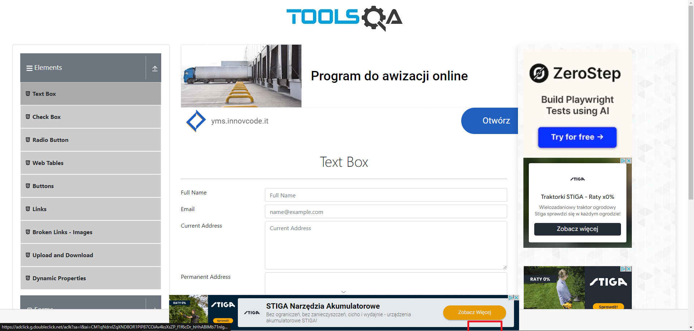
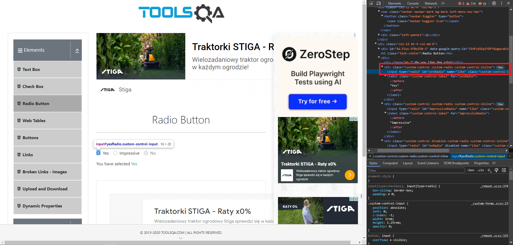
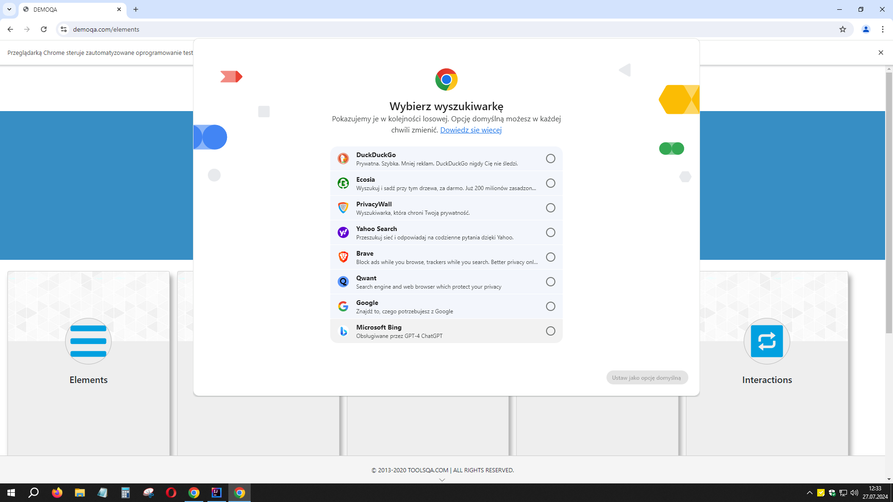

# 💥Rozwiązane problemy

## 📑Spis

1. [Przycisk zasłonięty przez inny element strony](#1)
2. [Przyciski zasłonięte przez reklamę - usunięcie elementu strony](#2)
3. [Brak dostępu do prywatnego WebElementu na potrzeby Asercji w teście](#3)
4. [Sprawdzanie czy element nie jest widoczny - błąd znajdowania elementu](#4)
5. [Przycisk - widoczny, ale wewnątrz innego elementu](#5)
6. [Przycisk - czy element jest klikalny](#6)
7. [Wait - czekanie aż element będzie zawierał określony tekst](#7)
8. [Uszkodzony obrazek / Zepsuty link](#8)
9. [Obrazek - wymiary](#9)
- [Chrome - okno wybrania domyślnej wyszukiwarki](#chrome_search_window)

## 📄Opis

### 1. Przycisk zasłonięty przez inny element strony <a name="1"></a>

**Linki:**  
[Dlaczego kliknięcia Selenium nie działają](https://www.lucidchart.com/techblog/2020/01/21/why-selenium-clicks-fail/)  
[Wait - element_to_be_clickable()](https://stackoverflow.com/questions/48665001/can-not-click-on-a-element-elementclickinterceptedexception-in-splinter-selen)  
[Jak użyć JavaScript w języku Java](https://stackoverflow.com/questions/11430773/how-to-use-javascript-with-selenium-webdriver-java)  
Dodatkowe:  
https://stackoverflow.com/questions/75412264/how-to-use-click-function-of-selenium-in-case-of-button-attribute-in-html  
https://stackoverflow.com/questions/54192441/how-to-click-link-being-covered-by-another-element-python-3-6-and-selenium

Podczas testów strony [Tools QA](https://demoqa.com/) okazało się, że wyskakujące reklamy zasłaniają przycisk **\[Submit\]**.
Przy standardowych próbach kliknięcia był zwracany błąd, że kolejny oczekiwany element po tym kliknięciu nie istnieje.
Po dodaniu *wait'a*, który miał czekać, aż element będzie klikalny, zaczął być zwracany komunikat z błędem informujący, że
element nie mógł zostać kliknięty, ponieważ został zasłonięty przez inny element (oraz wymieniono jego nazwę).

Ostatecznie okazało się, że najlepszym sposobem jest użycie JavaScriptu, ponieważ ma on zdolność "omijania" przysłaniających
elementów strony.  
Można jego obiekt inicjować w `BasePage` dzięki czemu będziemy mieli do niego łatwiejszy dostęp, jakbyśmy musieli używać go
dla wielu metod klikających.  
Wydaje mi się, że można by próbować jeszcze zasymulować naciśniecie klawisza **\[PgDn\]**, który by przewinął całą stronę
niżej, po czym moglibyśmy kliknąć odsłonięty przycisk.

Próba 1 - użycie 'actions'

```Java
actions.moveToElement(this.submitButton).click().perform();
lub
actions.scrollToElement(this.submitButton).click().perform();
```

Próba 2 - dodanie zwykłego wait'a
```Java
driver.manage().timeouts().implicitlyWait(Duration.ofSeconds(1));
```

Próba 3 - napisanie wait'a, który czeka aż element będzie klikalny
```Java
defaultWait.until(ExpectedConditions.elementToBeClickable(this.submitButton)).click();
```

Próba 4 - użycie JavaScript

```Java
JavascriptExecutor jse = (JavascriptExecutor)driver;
jse.executeScript("arguments[0].click();", this.submitButton);
```

---

### 2. Przyciski zasłonięte przez reklamę - usunięcie elementu strony <a name="2"></a>

**Linki:**  
https://stackoverflow.com/questions/70222166/how-do-i-remove-an-element-in-selenium-python

Podczas testów strony [Tools QA](https://demoqa.com/) okazało się, że wyskakująca reklama na dole strony blokuje wszystkie
przyciski na każdej pod-stronie. Samo omijanie tego tak jak to zrobiono w punkcie wyżej, nie wystarczyło.

Postanowiłem usuwać tego DIV'a przy każdym wejściu na tę stronę.  
Użyłem poniższego kodu:  
```Java
jse.executeScript("arguments[0].remove();", adFrame);
```

---

### 3. Brak dostępu do prywatnego WebElementu na potrzeby Asercji w teście <a name="3"></a>

**Linki:**  
https://www.w3schools.com/java/java_encapsulation.asp

Pisząc testy, trzymałem się założenia, że asercje powinny być w testach, a nie w metodach page'y.
Gdy chciałem w teście sprawdzić stan danego WebElementu to nie mogłem tego zrobić, ponieważ w klasie Page został on
zadeklarowany jako prywatny.  
Rozwiązaniem tego okazało się napisanie Gettera:
```Java
Klasa z Page:
@FindBy(css = "label[for='tree-node-home'] input")
private WebElement assertHomeCheckBox;

public WebElement getAssertHomeCheckBox() {
    return assertHomeCheckBox;
}

Klasa z testem:
assertThat(checkBoxPage.getAssertHomeCheckBox().isSelected()).isTrue();
```

---

### 4. Sprawdzanie czy element nie jest widoczny - błąd znajdowania elementu <a name="4"></a>

**Linki:**
https://stackoverflow.com/a/62684271

W teście chciałem sprawdzić czy dany element nie jest już widoczny.  
Asercja, która to miała sprawdzać, zwracała błąd, ponieważ już na początkowym etapie WebElement nie był odnajdywany.  
Rozwiązaniem tego było napisanie takiej, ogólnodostępnej funkcji:
```Java
public class WebElementMethods {

    public boolean isElementPresent(WebElement webElement) {
        try{
            webElement.isDisplayed();
            return true;
        }
        catch(NoSuchElementException e){
            return false;
        }
    };
}

Asercja w teście:
assertThat(webElementMethods.isElementPresent(desktopCheckBox)).isFalse();
```

---

### 5. Przycisk - widoczny, ale wewnątrz innego elementu <a name="5"></a>

**Linki:**
https://stackoverflow.com/a/19763087


Jeżeli przycisk jest **widoczny** na stronie, ale znajduje się wewnątrz innego elementu to można użyć `Actions`:
```Java
public RadioButtonPage clickYesRadioButton() {
    actions.moveToElement(this.yesRadioButton).click().perform();
    return this;
}
```

---

### 6. Przycisk - czy element jest klikalny <a name="6"></a>


Przy próbie kliknięcia przycisku, który nie jest klikalny, zwracany jest błąd.  
Żeby takie coś sprawdzać, warto napisać i stosować poniższą metodę:
```Java
public boolean isElementClickable(WebElement webElement) {
    try {
        actions.moveToElement(webElement).click().perform();
        return true;
    } catch (JsonException e) {
        return false;
    }
}

Test:
assertThat(webElementMethods.isElementClickable(noRadioButton)).isFalse();
```

---

### 7. Wait - czekanie aż element będzie zawierał określony tekst <a name="7"></a>

**Linki:**  
https://www.browserstack.com/guide/wait-commands-in-selenium-webdriver

Na stronie: https://demoqa.com/links  
Podczas klikania na linki z sekcji API call test się wywalał, ponieważ napis po kliknięciu zmieniał się wolniej,
niż leciał test. Wstępnie metoda `Thread.sleep(1000)` pomogła, ale że nie jest to zalecany sposób, użyłem czegoś innego.  
Tzw. **ExpectedConditions** zawierają metody czekające na określone warunki dla elementu. Pełna lista w linku.  
Poniższa metoda "czeka", aż element będzie zawierał określony przez nas tekst:
```Java
defaultWait.until(ExpectedConditions.textToBePresentInElement(linkResponseMessage, expectedText));
```

---

### 8. Uszkodzony obrazek / Zepsuty link <a name="8"></a>

W Selenium nie da się za bardzo sprawdzać, czy dany obrazek lub link jest zepsuty.  
W rozwiązaniu tego problemu pomogła poniższa metoda:
```Java
public int getHttpStatus(WebElement webElement, String attributeName) {
    int responseCode = 0;
    try {
        String elementUrl = webElement.getAttribute(attributeName);
        URL url = new URI(elementUrl).toURL();
        HttpURLConnection connection = (HttpURLConnection) url.openConnection();
        connection.setRequestMethod("HEAD");
        responseCode = connection.getResponseCode();
    } catch (Exception e) {
        System.out.println("An error occurred while retrieving the HTTP status of Web Element");
    }
    return responseCode;
}
```
Łączy się przez adres URL danego elementu i zwraca jego status code, który w teście możemy porównać z oczekiwanym.  
Przykład użycia w teście:
```Java
int responseCode = brokenLinksImagesPage.getHttpStatus(brokenImage, "src");
assertThat(responseCode).isEqualTo(200);
```

---

### 9. Obrazek - wymiary <a name="9"></a>

Żeby pobrać wymiary obrazka, trzeba użyć JavascriptExecutor:
```Java
public int getImageWidth(WebElement webElement) {
    return ((Long) jse.executeScript("return arguments[0].naturalWidth;", webElement)).intValue();
}

public int getImageHeight(WebElement webElement) {
    return ((Long) jse.executeScript("return arguments[0].naturalHeight", webElement)).intValue();
}
```
Użycie w teście:
```Java
int actualImageWidth = brokenLinksImagesPage.getImageWidth(brokenImage);
int actualImageHeight = brokenLinksImagesPage.getImageHeight(brokenImage);

assertThat(actualImageWidth).isEqualTo(expectedImageWidth);
assertThat(actualImageHeight).isEqualTo(expectedImageHeight);
```

---

## Chrome - okno wybrania domyślnej wyszukiwarki <a name="chrome_search_window"></a>

**Linki:**  
https://stackoverflow.com/questions/78787332/selecting-default-search-engine-is-needed-for-chrome-version-127

**Problem:**  
Od wersji 127, przy każdym uruchamianym teście na środku okna z przeglądarką, było wyświetlane okno wybrania domyślnej wyszukiwarki:


**Rozwiązanie:**  
Do opcji ChromeDrivera należy dodać:
```Java
options.addArguments("--disable-search-engine-choice-screen");
```

---

