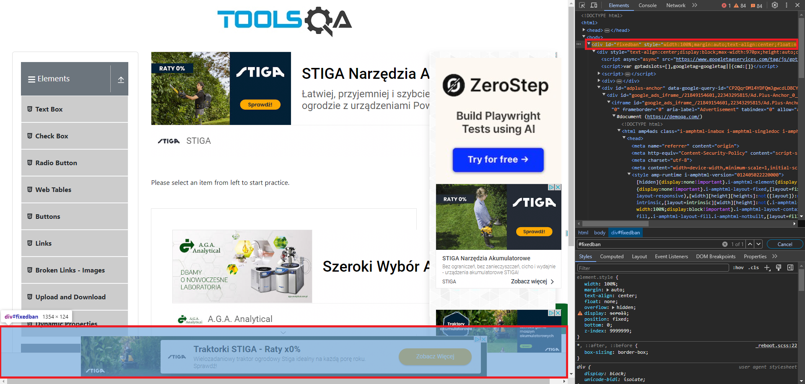
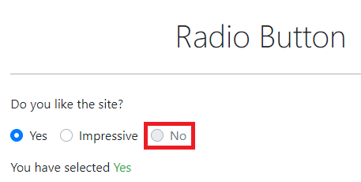
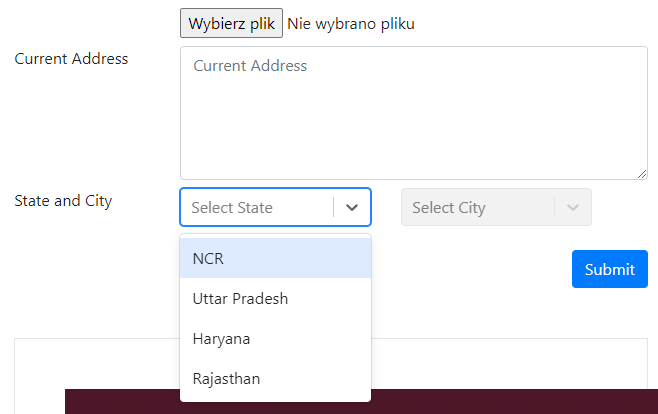

# 💥Rozwiązane problemy

## 📑Spis

- [WebElementy (przycisk) - zasłonięty przez inny element strony](#element_covered_by_another_element)
- [WebElementy - zasłonięte przez reklamę, usunięcie elementu strony](#webelement_remove)
- [WebElementy - dynamiczny lokator](#webelement_dynamic_locator)
- [Brak dostępu do prywatnego WebElementu na potrzeby Asercji w teście](#private_webelement)
- [Sprawdzanie, czy element nie jest widoczny - błąd znajdowania elementu](#assert_element_not_visible)
- [Przycisk - widoczny, ale wewnątrz innego elementu](#button_inside_other_element)
- [Przycisk - czy element jest klikalny](#button_clickable)
- [Wait - czekanie, aż element będzie zawierał określony tekst](#wait_for_text)
- [Uszkodzony obrazek / Zepsuty link](#broken_image_link)
- [Obrazek - wymiary](#image_dimensions)
- [Chrome - okno wybrania domyślnej wyszukiwarki](#chrome_search_window)
- [Select - utrzymanie rozwiniętej listy za pomocą DevTools](#select_hold_expanded)
- [Maven/Dependencies - błąd po podniesieniu wersji](#maven_dependencies_up)

# 📄Opis

## WebElementy (przycisk) - zasłonięty przez inny element strony <a name="element_covered_by_another_element"></a>

**Linki:**  
[Dlaczego kliknięcia Selenium nie działają](https://www.lucidchart.com/techblog/2020/01/21/why-selenium-clicks-fail/)  
[Wait - element_to_be_clickable()](https://stackoverflow.com/questions/48665001/can-not-click-on-a-element-elementclickinterceptedexception-in-splinter-selen)  
[Jak użyć JavaScript w języku Java](https://stackoverflow.com/questions/11430773/how-to-use-javascript-with-selenium-webdriver-java)  
Dodatkowe:  
https://stackoverflow.com/questions/75412264/how-to-use-click-function-of-selenium-in-case-of-button-attribute-in-html  
https://stackoverflow.com/questions/54192441/how-to-click-link-being-covered-by-another-element-python-3-6-and-selenium

**Problem:**  
Podczas testów strony [Tools QA](https://demoqa.com/) okazało się, że wyskakujące reklamy zasłaniają przycisk **\[Submit\]**.
Przy standardowych próbach kliknięcia był zwracany błąd, że kolejny oczekiwany element po tym kliknięciu nie istnieje.
Po dodaniu *wait'a*, który miał czekać, aż element będzie klikalny, zaczął być zwracany komunikat z błędem informujący, że
element nie mógł zostać kliknięty, ponieważ został zasłonięty przez inny element (oraz wymieniono jego nazwę).


**Rozwiązanie:**  
Ostatecznie okazało się, że najlepszym sposobem jest użycie JavaScriptu, ponieważ ma on zdolność "omijania" przysłaniających
elementów strony.  
Można jego obiekt inicjować w `BasePage` dzięki czemu będziemy mieli do niego łatwiejszy dostęp, jakbyśmy musieli używać go
dla wielu metod klikających.  
Wydaje mi się, że można by próbować jeszcze zasymulować naciśniecie klawisza **\[PgDn\]**, który by przewinął całą stronę
niżej, po czym moglibyśmy kliknąć odsłonięty przycisk.

Próba 1 - użycie 'actions'

```Java
actions.moveToElement(this.submitButton).click().perform();
lub
actions.scrollToElement(this.submitButton).click().perform();
```

Próba 2 - dodanie zwykłego wait'a
```Java
driver.manage().timeouts().implicitlyWait(Duration.ofSeconds(1));
```

Próba 3 - napisanie wait'a, który czeka aż element będzie klikalny
```Java
defaultWait.until(ExpectedConditions.elementToBeClickable(this.submitButton)).click();
```

Próba 4 - użycie JavaScript

```Java
JavascriptExecutor jse = (JavascriptExecutor)driver;
jse.executeScript("arguments[0].click();", this.submitButton);
```

---

## WebElementy - zasłonięte przez reklamę, usunięcie elementu strony <a name="webelement_remove"></a>

**Linki:**  
https://stackoverflow.com/questions/70222166/how-do-i-remove-an-element-in-selenium-python

**Problem:**  
Podczas testów strony [Tools QA](https://demoqa.com/) okazało się, że wyskakująca reklama na dole strony blokuje wszystkie
przyciski na każdej pod-stronie. Samo omijanie tego tak jak to zrobiono w punkcie wyżej, nie wystarczyło.


**Rozwiązanie:**  
Postanowiłem usuwać tego DIV'a przy każdym wejściu na tę stronę.  
Użyłem poniższego kodu:  
```Java
jse.executeScript("arguments[0].remove();", adFrame);
```

---

## WebElementy - dynamiczny lokator <a name="webelement_dynamic_locator"></a>

**Problem:**  
Na stronie zamiast pola typu `Select` był DIV, który rozwijał listę DIV'ów.  
Po kliknięciu w niego każdy element miał inny tekst i tylko po tekście można było wybrać dany element z listy.  

**Rozwiązanie:**  
Zrodził się z tego pomysł na "dynamiczny lokator" do którego po prostu byłby podstawiany dany tekst.

Najpierw musimy główny lokator zapisać jako String.  
Dlaczego tak?  
Ponieważ do lokatora zadeklarowanego w adnotacji `@FindBy` nie ma dostępu oraz nie da się go przerobić na String.  
Lokator umieszczony w tej adnotacji jest tworzony dopiero podczas uruchamiania testu z nim związanego.  
Zapisałem to w taki sposób:  
```JAVA
// State and City
private final String stateSelectXpath = "//div[@id='state']";
@FindBy(xpath = stateSelectXpath)
private WebElement stateSelect;
```

Następnie w metodzie dorobiłem do tego tworzenie "dynamicznego lokatora":  
```JAVA
// State and City

public PracticeFormPage selectState(String state) {
    stateSelect.click();
    String stateSelectOptionXpath = stateSelectXpath + "//div[text()='" + state + "']";
    WebElement stateSelectOptionLocator = driver.findElement(By.xpath(stateSelectOptionXpath));
    WebElement stateSelectOption = defaultWait.until(ExpectedConditions.elementToBeClickable(stateSelectOptionLocator));
    stateSelectOption.click();
    return this;
}
```

**Wyjaśnienie:**
- Najpierw klikamy w główny lokator rozwijający pole z listą elementów.
- Następnie tworzymy nowy String pod lokator dla jednego z elementów listy. Podstawiamy tutaj jako tekst nazwę jednego
z elementów listy
- Następnie deklarujemy ten nowy lokator jako WebElement używając standardowej składni `driver.findElement(By...)`
podstawiając nasz String pod ścieżkę Xpath tego nowego lokatora
- Dodajemy "wait" czekający, aż elementy z listy zostaną wyświetlone (będą klikalne)
- Klikamy na jeden z elementów listy

---

## Brak dostępu do prywatnego WebElementu na potrzeby Asercji w teście <a name="private_webelement"></a>

**Linki:**  
https://www.w3schools.com/java/java_encapsulation.asp

**Problem:**  
Pisząc testy, trzymałem się założenia, że asercje powinny być w testach, a nie w metodach page'y.
Gdy chciałem w teście sprawdzić stan danego WebElementu to nie mogłem tego zrobić, ponieważ w klasie Page został on
zadeklarowany jako prywatny.

**Rozwiązanie:**  
Rozwiązaniem tego okazało się napisanie Gettera:
```Java
Klasa z Page:
@FindBy(css = "label[for='tree-node-home'] input")
private WebElement assertHomeCheckBox;

public WebElement getAssertHomeCheckBox() {
    return assertHomeCheckBox;
}

Klasa z testem:
assertThat(checkBoxPage.getAssertHomeCheckBox().isSelected()).isTrue();
```

---

## Sprawdzanie, czy element nie jest widoczny - błąd znajdowania elementu <a name="assert_element_not_visible"></a>

**Linki:**  
https://stackoverflow.com/a/62684271

**Problem:**  
W teście chciałem sprawdzić, czy dany element nie jest już widoczny.  
Asercja, która to miała sprawdzać, zwracała błąd, ponieważ już na początkowym etapie WebElement nie był odnajdywany.

**Rozwiązanie:**  
Rozwiązaniem tego było napisanie takiej, ogólnodostępnej funkcji:
```Java
public class WebElementMethods {

    public boolean isElementPresent(WebElement webElement) {
        try{
            webElement.isDisplayed();
            return true;
        }
        catch(NoSuchElementException e){
            return false;
        }
    };
}

Asercja w teście:
assertThat(webElementMethods.isElementPresent(desktopCheckBox)).isFalse();
```

---

## Przycisk - widoczny, ale wewnątrz innego elementu <a name="button_inside_other_element"></a>

**Linki:**  
https://stackoverflow.com/a/19763087

**Problem:**  
Przycisk jest widoczny na stronie, ale znajduje się wewnątrz innego elementu, przez co jest "przysłonięty" wewnątrz kodu strony.


**Rozwiązanie:**  
Jeżeli przycisk jest **widoczny** na stronie, ale znajduje się wewnątrz innego elementu to można użyć `Actions`:
```Java
public RadioButtonPage clickYesRadioButton() {
    actions.moveToElement(this.yesRadioButton).click().perform();
    return this;
}
```

---

## Przycisk - czy element jest klikalny <a name="button_clickable"></a>

**Problem:**  
Przy próbie kliknięcia przycisku, który nie jest klikalny, zwracany jest błąd.  


**Rozwiązanie:**  
Żeby takie coś sprawdzać, warto napisać i stosować poniższą metodę:
```Java
public boolean isElementClickable(WebElement webElement) {
    try {
        actions.moveToElement(webElement).click().perform();
        return true;
    } catch (JsonException e) {
        return false;
    }
}

Test:
assertThat(webElementMethods.isElementClickable(noRadioButton)).isFalse();
```

---

## Wait - czekanie, aż element będzie zawierał określony tekst <a name="wait_for_text"></a>

**Linki:**  
https://www.browserstack.com/guide/wait-commands-in-selenium-webdriver

**Problem:**  
Na stronie: https://demoqa.com/links  
Podczas klikania na linki z sekcji API call test się wywalał, ponieważ napis po kliknięciu zmieniał się wolniej,
niż leciał test.

**Rozwiązanie:**  
Wstępnie metoda `Thread.sleep(1000)` pomogła, ale że nie jest to zalecany sposób, użyłem czegoś innego.  
Tzw. **ExpectedConditions** zawierają metody czekające na określone warunki dla elementu. Pełna lista w linku.  
Poniższa metoda "czeka", aż element będzie zawierał określony przez nas tekst:
```Java
defaultWait.until(ExpectedConditions.textToBePresentInElement(linkResponseMessage, expectedText));
```

---

## Uszkodzony obrazek / Zepsuty link <a name="broken_image_link"></a>

**Problem:**  
Jak sprawdzić, czy obrazek lub link jest zepsuty?

**Rozwiązanie:**  
W Selenium nie da się za bardzo sprawdzać, czy dany obrazek lub link jest zepsuty.  
W rozwiązaniu tego problemu pomogła poniższa metoda:
```Java
public int getHttpStatus(WebElement webElement, String attributeName) {
    int responseCode = 0;
    try {
        String elementUrl = webElement.getAttribute(attributeName);
        URL url = new URI(elementUrl).toURL();
        HttpURLConnection connection = (HttpURLConnection) url.openConnection();
        connection.setRequestMethod("HEAD");
        responseCode = connection.getResponseCode();
    } catch (Exception e) {
        System.out.println("An error occurred while retrieving the HTTP status of Web Element");
    }
    return responseCode;
}
```
Łączy się przez adres URL danego elementu i zwraca jego status code, który w teście możemy porównać z oczekiwanym.  
Przykład użycia w teście:
```Java
int responseCode = brokenLinksImagesPage.getHttpStatus(brokenImage, "src");
assertThat(responseCode).isEqualTo(200);
```

---

## Obrazek - wymiary <a name="image_dimensions"></a>

**Problem:**  
Jak pobrać wymiary obrazka, żeby je sprawdzić?

**Rozwiązanie:**  
Żeby pobrać wymiary obrazka, trzeba użyć JavascriptExecutor:
```Java
public int getImageWidth(WebElement webElement) {
    return ((Long) jse.executeScript("return arguments[0].naturalWidth;", webElement)).intValue();
}

public int getImageHeight(WebElement webElement) {
    return ((Long) jse.executeScript("return arguments[0].naturalHeight", webElement)).intValue();
}
```
Użycie w teście:
```Java
int actualImageWidth = brokenLinksImagesPage.getImageWidth(brokenImage);
int actualImageHeight = brokenLinksImagesPage.getImageHeight(brokenImage);

assertThat(actualImageWidth).isEqualTo(expectedImageWidth);
assertThat(actualImageHeight).isEqualTo(expectedImageHeight);
```

---

## Chrome - okno wybrania domyślnej wyszukiwarki <a name="chrome_search_window"></a>

**Linki:**  
https://stackoverflow.com/questions/78787332/selecting-default-search-engine-is-needed-for-chrome-version-127

**Problem:**  
Od wersji 127, przy każdym uruchamianym teście na środku okna z przeglądarką, było wyświetlane okno wybrania domyślnej wyszukiwarki:


**Rozwiązanie:**  
Do opcji ChromeDrivera należy dodać:
```Java
options.addArguments("--disable-search-engine-choice-screen");
```

---

## Select - utrzymanie rozwiniętej listy za pomocą DevTools <a name="select_hold_expanded"></a>

**Linki:**  
https://dev.to/kildareflare/inspect-disappearing-element-e-g-dropdown-menus-1khi

**Problem:**  
Podczas pisania testów nie dało się sprawdzić selektorów rozwiniętego pola typu select.  
Po rozwinięciu select'a i kliknięciu w DevToolsy na ten element rozwinięta lista tego select'a znikała.


**Rozwiązanie:**  
1. Otwieramy `DevTools`
2. Zaznaczamy element, który jest rozwijanym Select'em
3. W dolnej sekcji, gdzie wyświetlane są Style przełączamy się na zakładkę `Event Listeners`
4. Rozwijamy parametr `blur`
5. Klikamy po kolei ikonkę kosza na znajdujących się tam elementach i sprawdzamy, czy wartości select'a już się nie chowają

---

## Maven/Dependencies - błąd po podniesieniu wersji <a name="maven_dependencies_up"></a>

**Problem:**  
Po podniesieniu wersji wszystkich możliwych dependencies w Maven przy uruchamianiu testu w Selenium zaczął pojawiać się
poniższy błąd:  
`java.lang.NoClassDefFoundError: org/openqa/selenium/support/pagefactory/ElementLocatorFactory`

**Rozwiązanie:**  
Pomogło wyłączenie i włączenie IDE ponownie.
